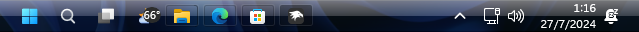

# Windows Vista theme for Windows 11 Taskbar Styler

**Author**: [Haitch-1](https://github.com/Haitch-1)



## Notes

This theme was intended to be used with a slim taskbar. You may achieve a slim taskbar with this mod:

* [Taskbar height and icon size](https://windhawk.net/mods/taskbar-icon-size)

  With these settings:

  ```yaml
  TaskbarHeight: 32
  IconSize: 16
  TaskbarButtonWidth: 38
  IconSizeSmall: 16
  TaskbarButtonWidthSmall: 32
  ```

## Theme selection

The theme is integrated into the mod and can be selected directly from the mod's
settings:

* Open the Windows 11 Taskbar Styler mod in Windhawk.
* Go to the "Settings" tab.
* Select the theme and save the settings.

## Manual installation

The theme styles can also be imported manually. To do that, follow these steps:

* Open the Windows 11 Taskbar Styler mod in Windhawk.
* Go to the "Settings" tab and select "Textual mode".
* Copy the content below to the text box and click "Save settings".

<details>
<summary>Content to import (click to expand)</summary>

```yaml
controlStyles:
  - target: Taskbar.ExperienceToggleButton
    styles:
      - CornerRadius=2
  - target: Taskbar.SearchBoxButton
    styles:
      - CornerRadius=2
  - target: Taskbar.TaskListButton
    styles:
      - CornerRadius=2
  - target: Taskbar.TaskListLabeledButtonPanel@RunningIndicatorStates > Rectangle#RunningIndicator
    styles:
      - Height=2
      - Width@ActiveRunningIndicator=30
      - Width@InactiveRunningIndicator=8
      - Fill@ActiveRunningIndicator=#00BEE0
      - Fill@InactiveRunningIndicator=#DDDDDD
  - target: Rectangle#BackgroundFill
    styles:
      - Fill:=<LinearGradientBrush StartPoint="0,0" EndPoint="0,1" Opacity="0.7"><GradientStop Color="#B5B9BC" Offset="0.0" /><GradientStop Color="#B5B9BC" Offset="0.03125" /><GradientStop Color="#909296" Offset="0.03125" /><GradientStop Color="#464B51" Offset="0.5" /><GradientStop Color="#060F15" Offset="0.5" /><GradientStop Color="#040C11" Offset="0.96875" /><GradientStop Color="#000000" Offset="0.96875" /><GradientStop Color="#000000" Offset="1.0" /></LinearGradientBrush>
  - target: Taskbar.TaskListLabeledButtonPanel@RunningIndicatorStates > Border
    styles:
      - Background@ActiveRunningIndicator:=<LinearGradientBrush StartPoint="0,0" EndPoint="0,1" Opacity="0.2"><GradientStop Color="#111111" Offset="0.0" /><GradientStop Color="#111111" Offset="1.0" /></LinearGradientBrush>
      - CornerRadius=2
      - Background@RequestingAttentionRunningIndicator:=<LinearGradientBrush StartPoint="0,0" EndPoint="0,1" Opacity="0.2"><GradientStop Color="#D53300" Offset="0.0" /><GradientStop Color="#111111" Offset="1.0" /></LinearGradientBrush>
      - BorderBrush=#33101010
      - BorderThickness=1
      - BorderBrush@NoRunningIndicator=Transparent
      - Background@NoRunningIndicator=Transparent
      - Background@ActiveRunningIndicator=#55BBBBBB
      - BorderBrush@ActiveRunningIndicator=#55212121
  - target: Taskbar.TaskListLabeledButtonPanel@CommonStates > Border#BackgroundElement
    styles:
      - Margin=0,0,0,2
      - BorderThickness=1
      - Background@ActivePointerOver=#88DDDDDD
      - Background@ActiveNormal=#33BBBBBB
      - Background@InactivePointerOver=#33BBBBBB
      - BorderBrush@ActiveNormal=#44AAAAAA
      - BorderBrush@ActivePointerOver=#FF888888
      - BorderBrush@InactiveNormal=Transparent
  - target: Taskbar.TaskListLabeledButtonPanel > TextBlock
    styles:
      - FontFamily=Segoe UI
  - target: SystemTray.AdaptiveTextBlock#LanguageInnerTextBlock > TextBlock#InnerTextBlock
    styles:
      - FontFamily=Segoe UI
  - target: TextBlock#TimeInnerTextBlock
    styles:
      - FontFamily=Segoe UI
  - target: Grid
    styles:
      - RequestedTheme=2
  - target: Taskbar.TaskbarBackground#BackgroundControl > Grid
    styles:
      - Background:=<AcrylicBrush TintColor="Transparent" TintOpacity="0" TintLuminosityOpacity="0.1" Opacity="1" />
  - target: Border#MultiWindowElement
    styles:
      - Background=#BB212121
      - BorderThickness=0
      - Margin=0,2,1,4
  - target: Grid#OverflowRootGrid > Border
    styles:
      - Background:=<LinearGradientBrush StartPoint="0,0" EndPoint="0,1" Opacity="0.7"><GradientStop Color="#B5B9BC" Offset="0.0" /><GradientStop Color="#B5B9BC" Offset="0.03125" /><GradientStop Color="#909296" Offset="0.03125" /><GradientStop Color="#464B51" Offset="0.5" /><GradientStop Color="#060F15" Offset="0.5" /><GradientStop Color="#040C11" Offset="0.96875" /><GradientStop Color="#000000" Offset="0.96875" /><GradientStop Color="#000000" Offset="1.0" /></LinearGradientBrush>
  - target: Grid#OverflowRootGrid
    styles:
      - Background:=<AcrylicBrush TintColor="Transparent" TintOpacity="0" TintLuminosityOpacity="0.1" Opacity="1" />
      - Padding=-1
      - Margin=0,6,0,6
      - CornerRadius=8
```
</details>
