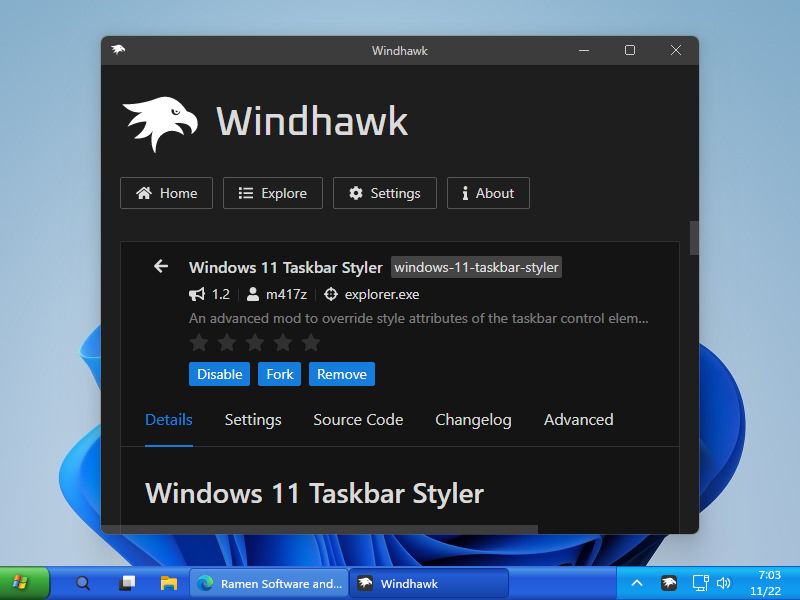

# WinXP theme for Windows 11 Taskbar Styler

This theme was created as a showcase for the [Windows 11 Taskbar
Styler](https://windhawk.net/mods/windows-11-taskbar-styler) mod, demonstrating
various customizations that can be done with it.

**Author**: [m417z](https://github.com/m417z)



## Notes

The following mods are recommended to use with this theme:

* [Taskbar height and icon size](https://windhawk.net/mods/taskbar-icon-size):
  Can be used to reduce the height and the icon size of the taskbar.
* [Taskbar Labels for Windows 11](https://windhawk.net/mods/taskbar-labels): Can
  be used to show labels for the taskbar buttons, and to make sure all buttons
  have an equal width.

## Theme selection

The theme is integrated into the mod, and can be simply selected from the mod's
settings:

* Open the Windows 11 Taskbar Styler mod in Windhawk.
* Go to the "Settings" tab.
* Select the theme and save the settings.

## Manual installation

The theme styles can also be imported manually. To do that, follow these steps:

* Open the Windows 11 Taskbar Styler mod in Windhawk.
* Go to the "Advanced" tab.
* Copy the content below to the text box under "Mod settings" and click "Save".

<details>
<summary>Content to import (click to expand)</summary>

```json
{
  "controlStyles[0].target": "Rectangle#BackgroundStroke",
  "controlStyles[0].styles[0]": "Fill:=<LinearGradientBrush StartPoint=\"0.5,0\" EndPoint=\"0.5,1\"> <GradientStop Color=\"#3168d5\" Offset=\"0.0\" /> <GradientStop Color=\"#4993E6\" Offset=\"0.1\" /> <GradientStop Color=\"#2157D7\" Offset=\"0.35\" /> <GradientStop Color=\"#2663E0\" Offset=\"0.8\" /> <GradientStop Color=\"#1941A5\" Offset=\"1.0\" /></LinearGradientBrush>",
  "controlStyles[0].styles[1]": "VerticalAlignment=Stretch",
  "controlStyles[0].styles[2]": "Height=Auto",
  "controlStyles[1].target": "Taskbar.ExperienceToggleButton#LaunchListButton[AutomationProperties.AutomationId=StartButton]",
  "controlStyles[1].styles[0]": "CornerRadius=0",
  "controlStyles[1].styles[1]": "Margin=0,0,4,0",
  "controlStyles[1].styles[2]": "MaxWidth=48",
  "controlStyles[2].target": "Taskbar.ExperienceToggleButton#LaunchListButton[AutomationProperties.AutomationId=StartButton] > Taskbar.TaskListButtonPanel",
  "controlStyles[2].styles[0]": "Padding=0",
  "controlStyles[2].styles[1]": "Background:=<LinearGradientBrush StartPoint=\"0.5,0\" EndPoint=\"0.5,1\"> <GradientStop Color=\"#388238\" Offset=\"0.0\" /> <GradientStop Color=\"#71B571\" Offset=\"0.1\" /> <GradientStop Color=\"#71B571\" Offset=\"0.35\" /> <GradientStop Color=\"#47AA47\" Offset=\"0.8\" /> <GradientStop Color=\"#307443\" Offset=\"1.0\" /></LinearGradientBrush>",
  "controlStyles[2].styles[2]": "MaxWidth=48",
  "controlStyles[3].target": "Taskbar.ExperienceToggleButton#LaunchListButton[AutomationProperties.AutomationId=StartButton] > Taskbar.TaskListButtonPanel > Border#BackgroundElement",
  "controlStyles[3].styles[0]": "Background:=<ImageBrush Stretch=\"None\" ImageSource=\"https://i.imgur.com/BvXJlkj.png\" />",
  "controlStyles[4].target": "Taskbar.ExperienceToggleButton#LaunchListButton[AutomationProperties.AutomationId=StartButton] > Taskbar.TaskListButtonPanel > Microsoft.UI.Xaml.Controls.AnimatedVisualPlayer#Icon",
  "controlStyles[4].styles[0]": "Visibility=Collapsed",
  "controlStyles[5].target": "TextBlock#LabelControl",
  "controlStyles[5].styles[0]": "Foreground=White",
  "controlStyles[6].target": "Rectangle#RunningIndicator",
  "controlStyles[6].styles[0]": "Visibility=Collapsed",
  "controlStyles[7].target": "TextBlock#TimeInnerTextBlock",
  "controlStyles[7].styles[0]": "Foreground=White",
  "controlStyles[8].target": "TextBlock#DateInnerTextBlock",
  "controlStyles[8].styles[0]": "Foreground=White",
  "controlStyles[9].target": "SystemTray.TextIconContent > Grid > SystemTray.AdaptiveTextBlock#Base > TextBlock",
  "controlStyles[9].styles[0]": "Foreground=White",
  "controlStyles[10].target": "Taskbar.TaskListLabeledButtonPanel@RunningIndicatorStates > Border#BackgroundElement",
  "controlStyles[10].styles[0]": "Background@NoRunningIndicator=Transparent",
  "controlStyles[10].styles[1]": "Background@ActiveRunningIndicator:=<LinearGradientBrush StartPoint=\"0.5,0\" EndPoint=\"0.5,1\"> <GradientStop Color=\"#1B67D7\" Offset=\"0.0\" /> <GradientStop Color=\"#1542A8\" Offset=\"0.1\" /> <GradientStop Color=\"#1951BA\" Offset=\"0.15\" /> <GradientStop Color=\"#1951BA\" Offset=\"0.95\" /> <GradientStop Color=\"#1542A8\" Offset=\"1.0\" /></LinearGradientBrush>",
  "controlStyles[10].styles[2]": "Background:=<LinearGradientBrush StartPoint=\"0.5,0\" EndPoint=\"0.5,1\"> <GradientStop Color=\"#3358B5\" Offset=\"0.0\" /> <GradientStop Color=\"#8AC4FD\" Offset=\"0.1\" /> <GradientStop Color=\"#56A3FF\" Offset=\"0.2\" /> <GradientStop Color=\"#56A3FF\" Offset=\"0.85\" /> <GradientStop Color=\"#378DF6\" Offset=\"0.9\" /> <GradientStop Color=\"#163E95\" Offset=\"1.0\" /></LinearGradientBrush>",
  "controlStyles[10].styles[3]": "BorderThickness@ActiveRunningIndicator=1",
  "controlStyles[10].styles[4]": "BorderBrush@NoRunningIndicator=Transparent",
  "controlStyles[10].styles[5]": "BorderBrush@ActiveRunningIndicator=#1B67D7",
  "controlStyles[10].styles[6]": "BorderBrush=#3358B5",
  "controlStyles[11].target": "Taskbar.TaskListButton",
  "controlStyles[11].styles[0]": "Margin=-1.5",
  "controlStyles[12].target": "Grid#SystemTrayFrameGrid",
  "controlStyles[12].styles[0]": "Background:=<LinearGradientBrush StartPoint=\"0.5,0\" EndPoint=\"0.5,1\"> <GradientStop Color=\"#16ADF0\" Offset=\"0.0\" /> <GradientStop Color=\"#19B9F3\" Offset=\"0.1\" /> <GradientStop Color=\"#118FE9\" Offset=\"0.35\" /> <GradientStop Color=\"#0E9EF0\" Offset=\"0.8\" /> <GradientStop Color=\"#1580D9\" Offset=\"1.0\" /></LinearGradientBrush>",
  "controlStyles[12].styles[1]": "BorderThickness=1,1,0,1",
  "controlStyles[12].styles[2]": "BorderBrush=#095BC9",
  "controlStyles[12].styles[3]": "Padding=4,0,0,0",
  "controlStyles[13].target": "Grid#OverflowRootGrid > Border",
  "controlStyles[13].styles[0]": "Background:=<LinearGradientBrush StartPoint=\"0.5,0\" EndPoint=\"0.5,1\"> <GradientStop Color=\"#3168d5\" Offset=\"0.0\" /> <GradientStop Color=\"#4993E6\" Offset=\"0.1\" /> <GradientStop Color=\"#2157D7\" Offset=\"0.35\" /> <GradientStop Color=\"#2663E0\" Offset=\"0.8\" /> <GradientStop Color=\"#1941A5\" Offset=\"1.0\" /></LinearGradientBrush>"
}
```
</details>

#### XP Zune
<details>
<summary>Content to import (click to expand)</summary>

```json
{
  "controlStyles[0].target": "Rectangle#BackgroundFill",
  "controlStyles[0].styles[0]": "Fill:=<LinearGradientBrush StartPoint=\"0.5,0.5\" EndPoint=\"0.5,1\"> <GradientStop Color=\"#656565\" Offset=\"0.0\" /> <GradientStop Color=\"#363636\" Offset=\"0.1\" /> <GradientStop Color=\"#363636\" Offset=\"0.35\" /> <GradientStop Color=\"#363636\" Offset=\"0.8\" /> <GradientStop Color=\"#363636\" Offset=\"1.0\" /></LinearGradientBrush>",
  "controlStyles[0].styles[1]": "VerticalAlignment=Stretch",
  "controlStyles[0].styles[2]": "Height=Auto",
  "controlStyles[1].target": "Taskbar.ExperienceToggleButton#LaunchListButton[AutomationProperties.AutomationId=StartButton]",
  "controlStyles[1].styles[0]": "CornerRadius=0",
  "controlStyles[1].styles[1]": "Margin=-4,0,4,0",
  "controlStyles[1].styles[2]": "MaxWidth=48",
  "controlStyles[2].target": "Taskbar.ExperienceToggleButton#LaunchListButton[AutomationProperties.AutomationId=StartButton] > Taskbar.TaskListButtonPanel",
  "controlStyles[2].styles[0]": "Padding=0",
  "controlStyles[2].styles[1]": "Background:=<LinearGradientBrush StartPoint=\"0.5,0.5\" EndPoint=\"0.5,1\"> <GradientStop Color=\"#D76A27\" Offset=\"0.05\" /> <GradientStop Color=\"#B44704\" Offset=\"0.1\" /> <GradientStop Color=\"#772E01\" Offset=\"0.5\" /> <GradientStop Color=\"#772E01\" Offset=\"1\" /> <GradientStop Color=\"#AA4201\" Offset=\"1\" /></LinearGradientBrush>",
  "controlStyles[3].target": "Taskbar.ExperienceToggleButton#LaunchListButton[AutomationProperties.AutomationId=StartButton] > Taskbar.TaskListButtonPanel > Border#BackgroundElement",
  "controlStyles[3].styles[0]": "Background:=<ImageBrush Stretch=\"Uniform\" ImageSource=\"https://i.imgur.com/BvXJlkj.png\" />",
  "controlStyles[3].styles[1]": "Height=32",
  "controlStyles[4].target": "Taskbar.ExperienceToggleButton#LaunchListButton[AutomationProperties.AutomationId=StartButton] > Taskbar.TaskListButtonPanel > Microsoft.UI.Xaml.Controls.AnimatedVisualPlayer#Icon",
  "controlStyles[4].styles[0]": "Visibility=Collapsed",
  "controlStyles[5].target": "TextBlock#LabelControl",
  "controlStyles[5].styles[0]": "Foreground=White",
  "controlStyles[6].target": "Rectangle#RunningIndicator",
  "controlStyles[6].styles[0]": "Visibility=Collapsed",
  "controlStyles[7].target": "TextBlock#TimeInnerTextBlock",
  "controlStyles[7].styles[0]": "Foreground=White",
  "controlStyles[8].target": "TextBlock#DateInnerTextBlock",
  "controlStyles[8].styles[0]": "Foreground=White",
  "controlStyles[9].target": "SystemTray.TextIconContent > Grid > SystemTray.AdaptiveTextBlock#Base > TextBlock",
  "controlStyles[9].styles[0]": "Foreground=White",
  "controlStyles[10].target": "Taskbar.TaskListLabeledButtonPanel@RunningIndicatorStates > Border#BackgroundElement",
  "controlStyles[10].styles[0]": "Background@ActiveRunningIndicator:=<LinearGradientBrush StartPoint=\"0.5,0.5\" EndPoint=\"0.5,1\"> <GradientStop Color=\"#6B6B6B\" Offset=\"0.0\" /> <GradientStop Color=\"#434343\" Offset=\"0.1\" /> <GradientStop Color=\"#434343\" Offset=\"0.35\" /> <GradientStop Color=#434343\" Offset=\"0.8\" /> <GradientStop Color=\"#434343\" Offset=\"1.0\" /></LinearGradientBrush>",
  "controlStyles[10].styles[1]": "Background:=<LinearGradientBrush StartPoint=\"0.5,0.5\" EndPoint=\"0.5,1\"> <GradientStop Color=\"#6B6B6B\" Offset=\"0.0\" /> <GradientStop Color=\"#434343\" Offset=\"0.1\" /> <GradientStop Color=\"#434343\" Offset=\"0.35\" /> <GradientStop Color=#434343\" Offset=\"0.8\" /> <GradientStop Color=\"#434343\" Offset=\"1.0\" /></LinearGradientBrush>",
  "controlStyles[10].styles[2]": "BorderThickness=1",
  "controlStyles[10].styles[3]": "BorderBrush@NoRunningIndicator=Transparent",
  "controlStyles[10].styles[4]": "CornerRadius=3",
  "controlStyles[11].target": "Taskbar.TaskListLabeledButtonPanel@RunningIndicatorStates > Border",
  "controlStyles[12].target": "Taskbar.TaskListLabeledButtonPanel@RunningIndicatorStates > Border#BackgroundElement",
  "controlStyles[12].styles[0]": "BorderBrush=#BB4B4B4B",
  "controlStyles[12].styles[1]": "Margin=1",
  "controlStyles[11].styles[0]": "BorderThickness=1",
  "controlStyles[12].styles[2]": "BorderThickness=1",
  "controlStyles[11].styles[1]": "CornerRadius=2",
  "controlStyles[11].styles[3]": "Margin=-2,-1,-2,-1",
  "controlStyles[12].styles[3]": "Background:=<LinearGradientBrush StartPoint=\"0.5,0.42\" EndPoint=\"0.5,0.75\"> <GradientStop Color=\"#6B6B6B\" Offset=\"0.0\" /> <GradientStop Color=\"#363636\" Offset=\"0.5\" /> <GradientStop Color=\"#363636\" Offset=\"0.35\" /> <GradientStop Color=\"#363636\" Offset=\"0.8\" /> <GradientStop Color=\"#363636\" Offset=\"1.0\" /></LinearGradientBrush>",
  "controlStyles[13].target": "Rectangle#BackgroundStroke",
  "controlStyles[13].styles[0]": "Fill=#858585",
  "controlStyles[14].target": "Grid#SystemTrayFrameGrid",
  "controlStyles[14].styles[0]": "Background:=<LinearGradientBrush StartPoint=\"0.5,0.42\" EndPoint=\"0.5,0.75\"> <GradientStop Color=\"#454545\" Offset=\"0.0\" /> <GradientStop Color=\"#313131\" Offset=\"0.5\" /> <GradientStop Color=\"#363636\" Offset=\"0.35\" /> <GradientStop Color=\"#1D1D1D\" Offset=\"0.8\" /> <GradientStop Color=\"#1D1D1D\" Offset=\"1.0\" /></LinearGradientBrush>",
  "controlStyles[14].styles[1]": "BorderThickness=1,0,0,0",
  "controlStyles[14].styles[2]": "BorderBrush=#222222",
  "controlStyles[14].styles[3]": "Padding=4,0,0,0",
  "controlStyles[15].target": "Taskbar.TaskListButton#TaskListButton > Taskbar.TaskListLabeledButtonPanel#IconPanel@RunningIndicatorStates > Windows.UI.Xaml.Controls.Image#Icon",
  "controlStyles[15].styles[0]": "Height@NoRunningIndicator=16",
  "controlStyles[11].styles[2]": "BorderBrush@NoRunningIndicator=Transparent",
  "controlStyles[12].styles[4]": "BorderBrush@NoRunningIndicator=Transparent",
  "controlStyles[12].styles[5]": "Background@NoRunningIndicator=Transparent",
  "controlStyles[16].styles[0]": "Margin@NoRunningIndicator=-7,0,-7,0",
  "controlStyles[16].target": "Taskbar.TaskListButton#TaskListButton > Taskbar.TaskListLabeledButtonPanel#IconPanel@RunningIndicatorStates",
  "controlStyles[16].styles[1]": "Padding@NoRunningIndicator=0",
  "controlStyles[17].target": "Taskbar.TaskListButton",
  "controlStyles[17].styles[0]": "Margin=-1.5",
  "controlStyles[18].target": "Grid#OverflowRootGrid > Border",
  "controlStyles[18].styles[0]": "Background:=<LinearGradientBrush StartPoint=\"0.5,0.5\" EndPoint=\"0.5,1\"> <GradientStop Color=\"#656565\" Offset=\"0.0\" /> <GradientStop Color=\"#363636\" Offset=\"0.1\" /> <GradientStop Color=\"#363636\" Offset=\"0.35\" /> <GradientStop Color=\"#363636\" Offset=\"0.8\" /> <GradientStop Color=\"#363636\" Offset=\"1.0\" /></LinearGradientBrush>"
}
```
</details>
