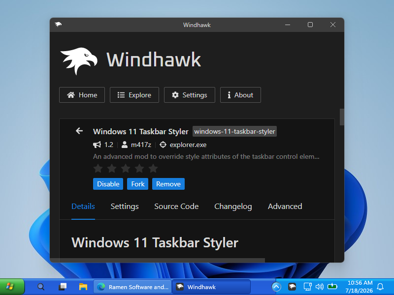

# WinXP theme for Windows 11 Taskbar Styler

This theme was created as a showcase for the [Windows 11 Taskbar
Styler](https://windhawk.net/mods/windows-11-taskbar-styler) mod, demonstrating
various customizations that can be done with it.

**Author**: [m417z](https://github.com/m417z)



## Notes

The following mods are recommended for use with this theme:

* [Taskbar height and icon size](https://windhawk.net/mods/taskbar-icon-size):
  Can be used to reduce the height and icon size of the taskbar.
* [Taskbar Labels for Windows 11](https://windhawk.net/mods/taskbar-labels): Can
  be used to show labels for the taskbar buttons and to make sure all buttons
  have an equal width.

## Theme selection

The theme is integrated into the mod and can be selected directly from the mod's
settings:

* Open the Windows 11 Taskbar Styler mod in Windhawk.
* Go to the "Settings" tab.
* Select the theme and save the settings.

## Manual installation

The theme styles can also be imported manually. To do that, follow these steps:

* Open the Windows 11 Taskbar Styler mod in Windhawk.
* Go to the "Settings" tab and select "Textual mode".
* Copy the content below to the text box and click "Save settings".

<details>
<summary>Content to import (click to expand)</summary>

```yaml
controlStyles:
  - target: Rectangle#BackgroundStroke
    styles:
      - Fill:=<LinearGradientBrush StartPoint="0.5,0" EndPoint="0.5,1"> <GradientStop Color="#3168d5" Offset="0.0" /> <GradientStop Color="#4993E6" Offset="0.1" /> <GradientStop Color="#2157D7" Offset="0.35" /> <GradientStop Color="#2663E0" Offset="0.8" /> <GradientStop Color="#1941A5" Offset="1.0" /></LinearGradientBrush>
      - VerticalAlignment=Stretch
      - Height=Auto
  - target: Taskbar.TaskbarBackground#HoverFlyoutBackgroundControl > Grid > Rectangle#BackgroundFill
    styles:
      - Fill:=<LinearGradientBrush StartPoint="0.5,0" EndPoint="0.5,1"> <GradientStop Color="#3168d5" Offset="0.0" /> <GradientStop Color="#4993E6" Offset="0.1" /> <GradientStop Color="#2157D7" Offset="0.35" /> <GradientStop Color="#2663E0" Offset="0.8" /> <GradientStop Color="#1941A5" Offset="1.0" /></LinearGradientBrush>
  - target: Taskbar.ExperienceToggleButton#LaunchListButton[AutomationProperties.AutomationId=StartButton]
    styles:
      - Margin=-9,0,10,0
  - target: Taskbar.ExperienceToggleButton#LaunchListButton[AutomationProperties.AutomationId=StartButton] > Taskbar.TaskListButtonPanel
    styles:
      - Padding=0
      - Width=60
      - CornerRadius=9
      - Background:=<LinearGradientBrush StartPoint="0.5,0" EndPoint="0.5,1"> <GradientStop Color="#2D6B2D" Offset="0.0" /> <GradientStop Color="#7ED57E" Offset="0.08" /> <GradientStop Color="#3DB43D" Offset="0.35" /> <GradientStop Color="#2A752E" Offset="0.85" /> <GradientStop Color="#144818" Offset="1.0" /></LinearGradientBrush>
      - BorderThickness=0,0,2,0
      - BorderBrush:=<LinearGradientBrush StartPoint="0.5,0" EndPoint="0.5,1"> <GradientStop Color="#400D330D" Offset="0.0" /> <GradientStop Color="#800D330D" Offset="0.4" /> <GradientStop Color="#FF0D330D" Offset="1.0" /></LinearGradientBrush>
  - target: Taskbar.ExperienceToggleButton#LaunchListButton[AutomationProperties.AutomationId=StartButton] > Taskbar.TaskListButtonPanel > Border#BackgroundElement
    styles:
      - Background:=<ImageBrush Stretch="None" ImageSource="https://raw.githubusercontent.com/ramensoftware/windows-11-taskbar-styling-guide/refs/heads/main/Themes/WinXP/Assets/orb.png" />
  - target: Taskbar.ExperienceToggleButton#LaunchListButton[AutomationProperties.AutomationId=StartButton] > Taskbar.TaskListButtonPanel > Microsoft.UI.Xaml.Controls.AnimatedVisualPlayer#Icon
    styles:
      - Visibility=Collapsed
  - target: TextBlock#LabelControl
    styles:
      - Foreground=White
  - target: Rectangle#RunningIndicator
    styles:
      - Visibility=Collapsed
  - target: TextBlock#TimeInnerTextBlock
    styles:
      - Foreground=White
  - target: TextBlock#DateInnerTextBlock
    styles:
      - Foreground=White
  - target: SystemTray.TextIconContent > Grid > SystemTray.AdaptiveTextBlock#Base > TextBlock
    styles:
      - Foreground=White
  - target: SystemTray.BatteryIconContent > Grid#ContainerGrid > StackPanel > Grid > TextBlock[1]
    styles:
      - Foreground=White
  - target: Taskbar.TaskListLabeledButtonPanel@RunningIndicatorStates > Border#BackgroundElement
    styles:
      - Background@NoRunningIndicator=Transparent
      - Background@ActiveRunningIndicator:=<LinearGradientBrush StartPoint="0.5,0" EndPoint="0.5,1"> <GradientStop Color="#1542A8" Offset="0.0" /> <GradientStop Color="#245DD4" Offset="0.2" /> <GradientStop Color="#1542A8" Offset="1.0" /></LinearGradientBrush>
      - Background:=<LinearGradientBrush StartPoint="0.5,0" EndPoint="0.5,1"> <GradientStop Color="#6599E6" Offset="0.0" /> <GradientStop Color="#4A88E0" Offset="0.1" /> <GradientStop Color="#4282D9" Offset="0.9" /> <GradientStop Color="#2A62B5" Offset="1.0" /></LinearGradientBrush>
      - BorderBrush@NoRunningIndicator=Transparent
      - BorderBrush@ActiveRunningIndicator=#083192
      - BorderBrush=#1A4DBF
  - target: Taskbar.TaskListButton
    styles:
      - Margin=-2
  - target: Grid#SystemTrayFrameGrid
    styles:
      - Background:=<LinearGradientBrush StartPoint="0.5,0" EndPoint="0.5,1"> <GradientStop Color="#16ADF0" Offset="0.0" /> <GradientStop Color="#19B9F3" Offset="0.1" /> <GradientStop Color="#118FE9" Offset="0.35" /> <GradientStop Color="#0E9EF0" Offset="0.8" /> <GradientStop Color="#1580D9" Offset="1.0" /></LinearGradientBrush>
      - BorderThickness=1,1,0,1
      - BorderBrush=#095BC9
      - Padding=4,-1,0,-1
  - target: Grid#OverflowRootGrid > Border
    styles:
      - Background:=<LinearGradientBrush StartPoint="0.5,0" EndPoint="0.5,1"> <GradientStop Color="#3168d5" Offset="0.0" /> <GradientStop Color="#4993E6" Offset="0.1" /> <GradientStop Color="#2157D7" Offset="0.35" /> <GradientStop Color="#2663E0" Offset="0.8" /> <GradientStop Color="#1941A5" Offset="1.0" /></LinearGradientBrush>
```
</details>

#### XP Zune
<details>
<summary>Content to import (click to expand)</summary>

```yaml
controlStyles:
  - target: Rectangle#BackgroundFill
    styles:
      - Fill:=<LinearGradientBrush StartPoint="0.5,0.5" EndPoint="0.5,1"> <GradientStop Color="#656565" Offset="0.0" /> <GradientStop Color="#363636" Offset="0.1" /> <GradientStop Color="#363636" Offset="0.35" /> <GradientStop Color="#363636" Offset="0.8" /> <GradientStop Color="#363636" Offset="1.0" /></LinearGradientBrush>
      - VerticalAlignment=Stretch
      - Height=Auto
  - target: Taskbar.ExperienceToggleButton#LaunchListButton[AutomationProperties.AutomationId=StartButton]
    styles:
      - CornerRadius=0
      - Margin=-4,0,4,0
      - MaxWidth=48
  - target: Taskbar.ExperienceToggleButton#LaunchListButton[AutomationProperties.AutomationId=StartButton] > Taskbar.TaskListButtonPanel
    styles:
      - Padding=0
      - Background:=<LinearGradientBrush StartPoint="0.5,0.5" EndPoint="0.5,1"> <GradientStop Color="#D76A27" Offset="0.05" /> <GradientStop Color="#B44704" Offset="0.1" /> <GradientStop Color="#772E01" Offset="0.5" /> <GradientStop Color="#772E01" Offset="1" /> <GradientStop Color="#AA4201" Offset="1" /></LinearGradientBrush>
  - target: Taskbar.ExperienceToggleButton#LaunchListButton[AutomationProperties.AutomationId=StartButton] > Taskbar.TaskListButtonPanel > Border#BackgroundElement
    styles:
      - Background:=<ImageBrush Stretch="Uniform" ImageSource="https://raw.githubusercontent.com/ramensoftware/windows-11-taskbar-styling-guide/refs/heads/main/Themes/WinXP/Assets/orb.png" />
      - Height=32
  - target: Taskbar.ExperienceToggleButton#LaunchListButton[AutomationProperties.AutomationId=StartButton] > Taskbar.TaskListButtonPanel > Microsoft.UI.Xaml.Controls.AnimatedVisualPlayer#Icon
    styles:
      - Visibility=Collapsed
  - target: TextBlock#LabelControl
    styles:
      - Foreground=White
  - target: Rectangle#RunningIndicator
    styles:
      - Visibility=Collapsed
  - target: TextBlock#TimeInnerTextBlock
    styles:
      - Foreground=White
  - target: TextBlock#DateInnerTextBlock
    styles:
      - Foreground=White
  - target: SystemTray.TextIconContent > Grid > SystemTray.AdaptiveTextBlock#Base > TextBlock
    styles:
      - Foreground=White
  - target: Taskbar.TaskListLabeledButtonPanel@RunningIndicatorStates > Border
    styles:
      - BorderThickness=1
      - CornerRadius=2
      - BorderBrush@NoRunningIndicator=Transparent
      - Margin=-2,-1,-2,-1
  - target: Taskbar.TaskListLabeledButtonPanel@RunningIndicatorStates > Border#BackgroundElement
    styles:
      - BorderBrush=#BB4B4B4B
      - Margin=1
      - BorderThickness=1
      - Background:=<LinearGradientBrush StartPoint="0.5,0.42" EndPoint="0.5,0.75"> <GradientStop Color="#6B6B6B" Offset="0.0" /> <GradientStop Color="#363636" Offset="0.5" /> <GradientStop Color="#363636" Offset="0.35" /> <GradientStop Color="#363636" Offset="0.8" /> <GradientStop Color="#363636" Offset="1.0" /></LinearGradientBrush>
      - Background@ActiveRunningIndicator:=<LinearGradientBrush StartPoint="0.5,0.5" EndPoint="0.5,1"> <GradientStop Color="#6B6B6B" Offset="0.0" /> <GradientStop Color="#434343" Offset="0.1" /> <GradientStop Color="#434343" Offset="0.35" /> <GradientStop Color="#434343" Offset="0.8" /> <GradientStop Color="#434343" Offset="1.0" /></LinearGradientBrush>
      - BorderBrush@NoRunningIndicator=Transparent
      - Background@NoRunningIndicator=Transparent
  - target: Rectangle#BackgroundStroke
    styles:
      - Fill=#858585
  - target: Grid#SystemTrayFrameGrid
    styles:
      - Background:=<LinearGradientBrush StartPoint="0.5,0.42" EndPoint="0.5,0.75"> <GradientStop Color="#454545" Offset="0.0" /> <GradientStop Color="#313131" Offset="0.5" /> <GradientStop Color="#363636" Offset="0.35" /> <GradientStop Color="#1D1D1D" Offset="0.8" /> <GradientStop Color="#1D1D1D" Offset="1.0" /></LinearGradientBrush>
      - BorderThickness=1,0,0,0
      - BorderBrush=#222222
      - Padding=4,0,0,0
  - target: Taskbar.TaskListButton#TaskListButton > Taskbar.TaskListLabeledButtonPanel#IconPanel@RunningIndicatorStates > Windows.UI.Xaml.Controls.Image#Icon
    styles:
      - Height@NoRunningIndicator=16
  - target: Taskbar.TaskListButton#TaskListButton > Taskbar.TaskListLabeledButtonPanel#IconPanel@RunningIndicatorStates
    styles:
      - Margin@NoRunningIndicator=-7,0,-7,0
      - Padding@NoRunningIndicator=0
  - target: Taskbar.TaskListButton
    styles:
      - Margin=-1.5
  - target: Grid#OverflowRootGrid > Border
    styles:
      - Background:=<LinearGradientBrush StartPoint="0.5,0.5" EndPoint="0.5,1"> <GradientStop Color="#656565" Offset="0.0" /> <GradientStop Color="#363636" Offset="0.1" /> <GradientStop Color="#363636" Offset="0.35" /> <GradientStop Color="#363636" Offset="0.8" /> <GradientStop Color="#363636" Offset="1.0" /></LinearGradientBrush>
```
</details>
