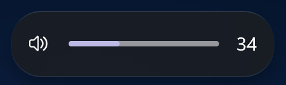
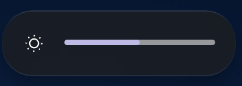
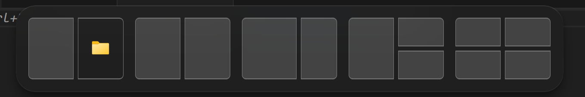
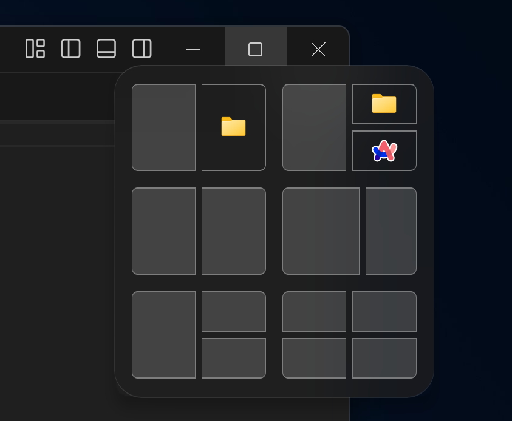

# WindowGlass theme for Windows 11 Taskbar Styler

A theme that adds a modern, glassy aesthetic with a compact, floating layout to the windows 11 Taskbar.

**Author**: [Nathaniel4JC](https://github.com/Nathaniel4JC)

## Left Aligned


## Center Aligned


## Bonus
- This Theme also Styles additional parts of Windows 11, including:

- **Volume and Brightness HUD**
 \


- **Window Snap Layout HUD**
 \
 \ 
 


## More Details about this theme
- Theme is designed on Windows 11 - 24H2
- Compatible with both Light/ Dark mode
- Install [vivo Sans En VF](https://1drv.ms/u/c/67fedd4420ed716d/EXRoW1f5dABJrO2dPj0tbM0Bm1uYiGeoKyAYA7X7er2Zww?e=cLsiJJ)

## For a complete WindowGlass themed UI, download the following mods and use the 'WindowGlass' theme:
- Windows 11 Start Menu Styler – for styling the Start Menu.
- Windows 11 Notification Center Styler - for styling the Notification Center and Action Center
- Windows 11 File Explorer Styler - for styling Windows Explorer windows

---

## Theme selection

The theme is integrated into the mod, and can be simply selected from the mod's
settings:

* Open the Windows 11 Taskbar Styler mod in Windhawk.
* Go to the "Settings" tab.
* Select the theme and save the settings.

## Manual installation

The theme styles can also be imported manually. To do that, follow these steps:

* Open the Windows 11 Taskbar Styler mod in Windhawk.
* Go to the "Advanced" tab.
* Copy the content below to the text box under "Mod settings" and click "Save".

<details>
<summary>Content to import (click to expand)</summary>

```json

{
  "controlStyles[0].target": "Taskbar.TaskbarFrame#TaskbarFrame",
  "controlStyles[0].styles[1]": "Width=Auto",
  "controlStyles[0].styles[0]": "MaxWidth:=900",
  "controlStyles[0].styles[2]": "MinWidth:=500",
  "controlStyles[0].styles[3]": "Height=70",
  "controlStyles[1].target": "Taskbar.TaskbarFrame#TaskbarFrame > Grid#RootGrid",
  "controlStyles[1].styles[0]": "Margin=30,0,30,5",
  "controlStyles[1].styles[1]": "BorderThickness=$BorderThickness",
  "controlStyles[1].styles[2]": "BorderBrush:=$BorderBrush",
  "controlStyles[1].styles[3]": "CornerRadius=$CornerRadius",
  "controlStyles[1].styles[4]": "Background:=$Background",
  "controlStyles[2].target": "Taskbar.TaskbarBackground#BackgroundControl > Windows.UI.Xaml.Controls.Grid > Windows.UI.Xaml.Shapes.Rectangle#BackgroundFill",
  "controlStyles[2].styles[0]": "Visibility=Collapsed",
  "controlStyles[3].target": "Taskbar.TaskbarBackground#BackgroundControl > Windows.UI.Xaml.Controls.Grid > Windows.UI.Xaml.Shapes.Rectangle#BackgroundStroke",
  "controlStyles[3].styles[0]": "Visibility=Collapsed",
  "controlStyles[4].target": "Taskbar.AugmentedEntryPointButton#AugmentedEntryPointButton > Taskbar.TaskListButtonPanel#ExperienceToggleButtonRootPanel",
  "controlStyles[4].styles[0]": "Margin=4",
  "controlStyles[4].styles[1]": "Background:=$ElementBG",
  "controlStyles[4].styles[2]": "CornerRadius=12",
  "controlStyles[5].target": "Grid#SystemTrayFrameGrid",
  "controlStyles[5].styles[0]": "Margin=0,7,20,7",
  "controlStyles[5].styles[1]": "RenderTransform:=<TranslateTransform X=\"-85\" Y=\"-2\"/>",
  "controlStyles[5].styles[2]": "Background:=$ElementBG",
  "controlStyles[5].styles[3]": "BorderBrush:=$ElementBorderBrush",
  "controlStyles[5].styles[4]": "BorderThickness=$ElementBorderThickness",
  "controlStyles[6].target": "SystemTray.ChevronIconView",
  "controlStyles[6].styles[0]": "Padding=$TrayPadding",
  "controlStyles[6].styles[1]": "CornerRadius=10",
  "controlStyles[7].target": "SystemTray.NotifyIconView#NotifyItemIcon",
  "controlStyles[7].styles[0]": "Padding=$TrayPadding",
  "controlStyles[7].styles[1]": "CornerRadius=10",
  "controlStyles[8].target": "SystemTray.OmniButton",
  "controlStyles[8].styles[0]": "Padding=$TrayPadding",
  "controlStyles[8].styles[1]": "CornerRadius=10",
  "controlStyles[9].target": "SystemTray.CopilotIcon",
  "controlStyles[9].styles[0]": "Padding=$TrayPadding",
  "controlStyles[10].target": "SystemTray.OmniButton#NotificationCenterButton > Grid > ContentPresenter > ItemsPresenter > StackPanel > ContentPresenter > systemtray:IconView#SystemTrayIcon > Grid",
  "controlStyles[10].styles[0]": "Padding=$TrayPadding",
  "controlStyles[11].target": "SystemTray.IconView#SystemTrayIcon > Grid#ContainerGrid > ContentPresenter#ContentPresenter > Grid#ContentGrid > SystemTray.TextIconContent > Grid#ContainerGrid",
  "controlStyles[11].styles[0]": "Padding=10",
  "controlStyles[11].styles[1]": "CornerRadius=10",
  "controlStyles[12].target": "SystemTray.StackListView#IconStack > ItemsPresenter > StackPanel > ContentPresenter > SystemTray.IconView#SystemTrayIcon",
  "controlStyles[12].styles[0]": "Padding=0",
  "controlStyles[13].target": "SystemTray.Stack#ShowDesktopStack",
  "controlStyles[13].styles[0]": "Visibility=Visible",
  "controlStyles[14].target": "Taskbar.Gripper#GripperControl",
  "controlStyles[14].styles[0]": "Width=Auto",
  "controlStyles[14].styles[1]": "MinWidth=24",
  "controlStyles[15].target": "SystemTray.SystemTrayFrame",
  "controlStyles[15].styles[0]": "HorizontalAlignment=1",
  "controlStyles[15].styles[1]": "RenderTransform:=<TranslateTransform X=\"399\" />",
  "controlStyles[16].target": "Windows.UI.Xaml.Controls.Grid#AugmentedEntryPointContentGrid",
  "controlStyles[16].styles[0]": "Margin=4,0,0,0",
  "controlStyles[16].styles[1]": "HorizontalAlignment=Left",
  "controlStyles[17].target": "TextBlock#TimeInnerTextBlock",
  "controlStyles[17].styles[0]": "FontSize=13",
  "controlStyles[17].styles[1]": "FontFamily=vivo Sans EN VF",
  "controlStyles[17].styles[2]": "Margin=0",
  "controlStyles[17].styles[3]": "Padding=0",
  "controlStyles[17].styles[4]": "RenderTransform:=<TranslateTransform X=\"0\" Y=\"0\" />",
  "controlStyles[18].target": "TextBlock#DateInnerTextBlock",
  "controlStyles[18].styles[0]": "Visibility=Collapsed",
  "controlStyles[18].styles[1]": "RenderTransform:=<TranslateTransform X=\"0\" Y=\"-9\" />",
  "controlStyles[18].styles[2]": "FontSize=11",
  "controlStyles[18].styles[3]": "FontFamily=vivo Sans EN VF",
  "controlStyles[19].target": "TextBlock#InnerTextBlock[Text=]",
  "controlStyles[19].styles[0]": "Text=",
  "theme": "",
  "controlStyles[20].target": "Windows.UI.Xaml.Controls.Grid#ConfirmatorMainGrid",
  "controlStyles[20].styles[0]": "CornerRadius=22",
  "controlStyles[20].styles[1]": "BorderThickness=$BorderThickness",
  "controlStyles[20].styles[2]": "BorderBrush:=$BorderBrush",
  "controlStyles[20].styles[3]": "Background:=$Background",
  "controlStyles[21].target": "TextBlock#SearchBoxTextBlock",
  "controlStyles[21].styles[0]": "Text=Search This Precision",
  "controlStyles[21].styles[1]": "FontSize=10",
  "controlStyles[21].styles[2]": "FontFamily=vivo Sans EN VF",
  "controlStyles[22].target": "SystemTray.OmniButton#NotificationCenterButton > Grid > ContentPresenter > ItemsPresenter > StackPanel > ContentPresenter > SystemTray.IconView#SystemTrayIcon > Grid > Grid > SystemTray.TextIconContent",
  "controlStyles[22].styles[0]": "Visibility=Collapsed",
  "controlStyles[23].target": "Windows.UI.Xaml.Controls.Button",
  "controlStyles[23].styles[0]": "BorderThickness=$BorderThickness",
  "controlStyles[24].target": "Windows.UI.Xaml.Controls.Border#OverflowFlyoutBackgroundBorder",
  "controlStyles[24].styles[0]": "BorderThickness=$BorderThickness",
  "controlStyles[24].styles[1]": "BorderBrush:=$BorderBrush",
  "controlStyles[24].styles[2]": "Background:=$Background",
  "controlStyles[24].styles[3]": "CornerRadius=$CornerRadius",
  "controlStyles[25].target": "Windows.UI.Xaml.Controls.Grid#ModalRootGrid > Windows.UI.Xaml.Controls.Border#BackgroundElement",
  "controlStyles[25].styles[0]": "BorderThickness=$BorderThickness",
  "controlStyles[25].styles[1]": "BorderBrush:=$BorderBrush",
  "controlStyles[25].styles[2]": "Background:=$Background",
  "controlStyles[25].styles[3]": "CornerRadius=20",
  "controlStyles[26].target": "WindowsInternal.ComposableShell.Experiences.Switcher.VirtualDesktopBarElement#VirtualDesktopBar",
  "controlStyles[26].styles[0]": "Width=1000",
  "controlStyles[26].styles[1]": "Visibility=Collapsed",
  "controlStyles[26].styles[2]": "RenderTransform:=<TranslateTransform X=\"0\" Y=\"60\" />",
  "controlStyles[26].styles[3]": "CornerRadius=$CornerRadius",
  "controlStyles[27].target": "Windows.UI.Xaml.Controls.Border#BackgroundDimmingLayer",
  "controlStyles[27].styles[0]": "Background:=<WindhawkBlur BlurAmount=\"15\" TintColor=\"#10808080\"/>",
  "controlStyles[28].target": "Taskbar.TaskListButtonPanel#ExperienceToggleButtonRootPanel > Windows.UI.Xaml.Controls.Border#BackgroundElement",
  "controlStyles[28].styles[0]": "CornerRadius=10",
  "controlStyles[29].target": "Taskbar.TaskListButton#TaskListButton",
  "controlStyles[29].styles[0]": "CornerRadius=10",
  "controlStyles[30].target": "Windows.UI.Xaml.Controls.Border#SnapBarBorder",
  "controlStyles[30].styles[0]": "Background:=$Background",
  "controlStyles[30].styles[1]": "BorderBrush:=$BorderBrush",
  "controlStyles[30].styles[2]": "CornerRadius=$CornerRadius",
  "controlStyles[30].styles[3]": "BorderThickness=$BorderThickness",
  "controlStyles[30].styles[4]": "RenderTransform:=<TranslateTransform X=\"0\" Y=\"10\" />",
  "controlStyles[30].styles[5]": "Margin=0,0,0,-10",
  "controlStyles[31].target": "Windows.UI.Xaml.Controls.Border#SnapPickerBorder",
  "controlStyles[31].styles[0]": "Background:=$Background",
  "controlStyles[31].styles[1]": "BorderBrush:=$BorderBrush",
  "controlStyles[31].styles[2]": "CornerRadius=$CornerRadius",
  "controlStyles[31].styles[3]": "BorderThickness=$BorderThickness",
  "controlStyles[32].target": "Windows.UI.Xaml.Controls.Border#SearchPillBackgroundElement",
  "controlStyles[32].styles[0]": "BorderBrush:=$ElementBorderBrush",
  "controlStyles[32].styles[1]": "CornerRadius=$ElementCornerRadius",
  "controlStyles[32].styles[2]": "BorderThickness=$ElementBorderThickness",
  "controlStyles[33].target": "Taskbar.TaskbarExtensionElement",
  "controlStyles[33].styles[0]": "RenderTransform:=<TranslateTransform X=\"0\" Y=\"0\" />",
  "controlStyles[34].target": "Taskbar.TaskListButtonPanel#ExperienceToggleButtonRootPanel",
  "controlStyles[34].styles[0]": "RenderTransform:=<TranslateTransform X=\"0\" Y=\"0\" />",
  "controlStyles[32].styles[3]": "Margin=0",
  "controlStyles[35].target": "Windows.UI.Xaml.Controls.ToolTip > Windows.UI.Xaml.Controls.ContentPresenter#LayoutRoot",
  "controlStyles[35].styles[0]": "Background:=$Background",
  "controlStyles[35].styles[1]": "BorderBrush:=$BorderBrush",
  "controlStyles[35].styles[2]": "BorderThickness:=$BorderThickness",
  "controlStyles[35].styles[3]": "CornerRadius=12",
  "controlStyles[36].target": "SearchUx.SearchUI.SearchButtonControl",
  "controlStyles[36].styles[0]": "Width=130",
  "controlStyles[36].styles[1]": "Margin=-1,7,-1,7",
  "controlStyles[37].target": "WindowsInternal.ComposableShell.Experiences.Switcher.VirtualDesktopBarElement > Windows.UI.Xaml.Controls.Grid#GridElement > Windows.UI.Xaml.Controls.Border#VirtualDesktopSwitcherBackground",
  "controlStyles[37].styles[0]": "Background:=$Background",
  "controlStyles[37].styles[1]": "BorderBrush:=$BorderBrush",
  "controlStyles[37].styles[2]": "BorderThickness=$BorderThickness",
  "controlStyles[37].styles[3]": "CornerRadius=$CornerRadius",
  "controlStyles[38].target": "Windows.UI.Xaml.Shapes.Rectangle#BackgroundFill",
  "controlStyles[38].styles[0]": "Fill:=$Background",
  "styleConstants[0]": "Background=<WindhawkBlur BlurAmount=\"2\" TintColor=\"#808080\" TintOpacity=\"0.1\" />",
  "styleConstants[1]": "BorderBrush2=<WindhawkBlur BlurAmount=\"10\" TintColor=\"#909090\" TintOpacity=\"0.2\"/>",
  "resourceVariables[0].variableKey": "",
  "resourceVariables[0].value": "",
  "styleConstants[2]": "BorderThickness=0.5,1,0.5,1",
  "styleConstants[3]": "CornerRadius=15",
  "styleConstants[4]": "BorderBrush=<LinearGradientBrush StartPoint=\"0,0\" EndPoint=\"0,1\"><GradientStop Color=\"#60808080\" Offset=\"0.0\" /><GradientStop Color=\"#50404040\" Offset=\"0.25\" /><GradientStop Color=\"#40808080\" Offset=\"1\" /></LinearGradientBrush>",
  "styleConstants[5]": "Background2=<AcrylicBrush TintColor=\"{ThemeResource SystemChromeMediumColor}\" TintOpacity=\"0.4\" FallbackColor=\"{ThemeResource SystemChromeMediumColor}\" />",
  "styleConstants[6]": "TrayPadding=2",
  "styleConstants[7]": "ElementBG=<SolidColorBrush Color=\"{ThemeResource SystemChromeAltHighColor}\" Opacity=\"0.3\" />",
  "styleConstants[8]": "ElementBorderThickness=0.3,0.3,0.3,1",
  "styleConstants[9]": "ElementBorderBrush=<LinearGradientBrush StartPoint=\"0,0\" EndPoint=\"0,1\"><GradientStop Color=\"#50808080\" Offset=\"1\" /><GradientStop Color=\"#50606060\" Offset=\"0.15\" /></LinearGradientBrush>",
  "styleConstants[10]": "ElementCornerRadius=12",
  "controlStyles[39].target": "SystemTray.SystemTrayFrame",
  "controlStyles[39].styles[0]": "Width=Auto",
  "controlStyles[39].styles[1]": "MaxWidth:=400",
  "controlStyles[39].styles[2]": "MinWidth:=150",
  "controlStyles[39].styles[3]": "Margin=10,0,20,0",
  "controlStyles[5].styles[5]": "CornerRadius=12",
  "controlStyles[39].styles[4]": "Height=70",
  "controlStyles[40].target": "Windows.UI.Xaml.Controls.Image#Icon",
  "controlStyles[40].styles[0]": "MaxHeight:=30",
  "controlStyles[40].styles[1]": "MinHeight:=20",
  "controlStyles[41].target": "Microsoft.UI.Xaml.Controls.AnimatedVisualPlayer#Icon",
  "controlStyles[40].styles[2]": "MaxWidth:=30",
  "controlStyles[40].styles[3]": "MinWidth:=20",
  "controlStyles[40].styles[4]": "Width=Auto",
  "controlStyles[40].styles[5]": "Height=Auto",
  "controlStyles[40].styles[6]": "Margin=2",
  "controlStyles[41].styles[0]": "MaxHeight:=30",
  "controlStyles[41].styles[1]": "MinHeight:=20",
  "controlStyles[41].styles[2]": "MaxWidth:=30",
  "controlStyles[41].styles[3]": "MinWidth:=20",
  "controlStyles[41].styles[4]": "Width=Auto",
  "controlStyles[41].styles[5]": "Height=Auto",
  "controlStyles[41].styles[6]": "Margin=2",
  "styleConstants[11]": "ElementSysColor=<SolidColorBrush Color=\"{ThemeResource SystemAccentColorLight1}\" Opacity=\"1\" />",
  "styleConstants[12]": "ElementSysColor2=<SolidColorBrush Color=\"{ThemeResource SystemAccentColorLight2}\" Opacity=\"1\" />",
  "styleConstants[13]": "ElementSysColor3=<SolidColorBrush Color=\"{ThemeResource SystemAccentColorLight3}\" Opacity=\"1\" />",
  "styleConstants[14]": "ElementSysColor4=<SolidColorBrush Color=\"{ThemeResource SystemAccentColorDark1}\" Opacity=\"1\" />"
}
```
</details>
