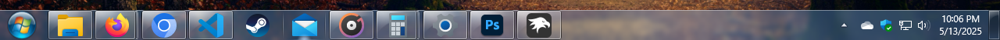

# Windows7 theme for Windows 11 Taskbar Styler

This theme is mostly a proof of concept, and due to the limitations of the XAML taskbar, it is not accurate to Windows 7. If you want an accurate Windows 7 taskbar, check out Explorer7 or ep_taskbar.

**Author**: [SandTechStuff](https://github.com/SandTechStuff)



> [!NOTE]
> An internet connection is required to use this theme, as the relevant images are downloaded from this repository. This is also the reason images may be slow to load on first use.
>
> This theme was designed for 100% display scaling.

## Required additional mod configuration

Mod: [Taskbar Height and Icon Size](https://windhawk.net/mods/taskbar-icon-size)

<details>
<summary>Content to import (click to expand)</summary>

```yaml
TaskbarHeight: 39
IconSize: 32
TaskbarButtonWidth: 58
IconSizeSmall: 16
TaskbarButtonWidthSmall: 32
```
</details>

## Theme selection

The theme is integrated into the mod and can be selected directly from the mod's
settings:

* Open the Windows 11 Taskbar Styler mod in Windhawk.
* Go to the "Settings" tab.
* Select the theme and save the settings.

## Manual installation

The theme styles can also be imported manually. To do that, follow these steps:

* Open the Windows 11 Taskbar Styler mod in Windhawk.
* Go to the "Advanced" tab.
* Copy the content below to the text box under "Mod settings" and click "Save".

<details>
<summary>Content to import (click to expand)</summary>

```yaml
styleConstants:
  - orbNormal=https://raw.githubusercontent.com/ramensoftware/windows-11-taskbar-styling-guide/refs/heads/main/Themes/Windows7/ThemeResources/orbNormal.png
  - orbPointerOver=https://raw.githubusercontent.com/ramensoftware/windows-11-taskbar-styling-guide/refs/heads/main/Themes/Windows7/ThemeResources/orbHover.png
  - orbPressed=https://raw.githubusercontent.com/ramensoftware/windows-11-taskbar-styling-guide/refs/heads/main/Themes/Windows7/ThemeResources/orbPressed.png
  - aeroColor={ThemeResource SystemAccentColor}
  - aeroOpacity=0.3
  - reflection=https://raw.githubusercontent.com/ramensoftware/windows-11-taskbar-styling-guide/refs/heads/main/Themes/Windows7/ThemeResources/AeroPeek.png
  - taskbandInactiveNormal=https://raw.githubusercontent.com/ramensoftware/windows-11-taskbar-styling-guide/refs/heads/main/Themes/Windows7/ThemeResources/InactiveNormal.png
  - taskbandInactivePointerOver=https://raw.githubusercontent.com/ramensoftware/windows-11-taskbar-styling-guide/refs/heads/main/Themes/Windows7/ThemeResources/InactivePointerOver.png
  - taskbandInactivePressed=https://raw.githubusercontent.com/ramensoftware/windows-11-taskbar-styling-guide/refs/heads/main/Themes/Windows7/ThemeResources/ActiveNormal.png
  - taskbandActiveNormal=https://raw.githubusercontent.com/ramensoftware/windows-11-taskbar-styling-guide/refs/heads/main/Themes/Windows7/ThemeResources/ActiveNormal.png
  - taskbandActivePointerOver=https://raw.githubusercontent.com/ramensoftware/windows-11-taskbar-styling-guide/refs/heads/main/Themes/Windows7/ThemeResources/ActiveNormal.png
  - taskbandActivePressed=https://raw.githubusercontent.com/ramensoftware/windows-11-taskbar-styling-guide/refs/heads/main/Themes/Windows7/ThemeResources/ActiveNormal.png
  - overflowNormal=https://raw.githubusercontent.com/ramensoftware/windows-11-taskbar-styling-guide/refs/heads/main/Themes/Windows7/ThemeResources/overflowNormal.png
  - overflowPointerOver=https://raw.githubusercontent.com/ramensoftware/windows-11-taskbar-styling-guide/refs/heads/main/Themes/Windows7/ThemeResources/overflowPointerOver.png
  - overflowPressed=https://raw.githubusercontent.com/ramensoftware/windows-11-taskbar-styling-guide/refs/heads/main/Themes/Windows7/ThemeResources/overflowPressed.png
  - clockPointerOver=https://raw.githubusercontent.com/ramensoftware/windows-11-taskbar-styling-guide/refs/heads/main/Themes/Windows7/ThemeResources/clockPointerOver.png
  - clockPressed=https://raw.githubusercontent.com/ramensoftware/windows-11-taskbar-styling-guide/refs/heads/main/Themes/Windows7/ThemeResources/clockPressed.png
  - trayPointerOver=https://raw.githubusercontent.com/ramensoftware/windows-11-taskbar-styling-guide/refs/heads/main/Themes/Windows7/ThemeResources/trayPointerOver.png
  - trayPressed=https://raw.githubusercontent.com/ramensoftware/windows-11-taskbar-styling-guide/refs/heads/main/Themes/Windows7/ThemeResources/trayPressed.png
  - desktopNormal=https://raw.githubusercontent.com/ramensoftware/windows-11-taskbar-styling-guide/refs/heads/main/Themes/Windows7/ThemeResources/desktopNormal.png
  - desktopPointerOver=https://raw.githubusercontent.com/ramensoftware/windows-11-taskbar-styling-guide/refs/heads/main/Themes/Windows7/ThemeResources/desktopPointerOver.png
  - desktopPressed=https://raw.githubusercontent.com/ramensoftware/windows-11-taskbar-styling-guide/refs/heads/main/Themes/Windows7/ThemeResources/desktopPressed.png
  - desktopWidth=15
  - taskbandRequestingAttention=https://raw.githubusercontent.com/ramensoftware/windows-11-taskbar-styling-guide/refs/heads/main/Themes/Windows7/ThemeResources/requestingAttention.png
  - taskbandNotRunningPointerOver=https://raw.githubusercontent.com/ramensoftware/windows-11-taskbar-styling-guide/refs/heads/main/Themes/Windows7/ThemeResources/notRunningPointerOver.png
  - taskbandNotRunningPressed=https://raw.githubusercontent.com/ramensoftware/windows-11-taskbar-styling-guide/refs/heads/main/Themes/Windows7/ThemeResources/notRunningPressed.png
  - taskbarBackground=https://raw.githubusercontent.com/ramensoftware/windows-11-taskbar-styling-guide/refs/heads/main/Themes/Windows7/ThemeResources/taskbarBackground.png
  - taskviewIcon=https://raw.githubusercontent.com/ramensoftware/windows-11-taskbar-styling-guide/refs/heads/main/Themes/Windows7/ThemeResources/taskview.png
  - searchIcon=https://raw.githubusercontent.com/ramensoftware/windows-11-taskbar-styling-guide/refs/heads/main/Themes/Windows7/ThemeResources/search.png
  - widgetsPointerOver=https://raw.githubusercontent.com/ramensoftware/windows-11-taskbar-styling-guide/refs/heads/main/Themes/Windows7/ThemeResources/widgetsPointerOver.png
  - widgetsPressed=https://raw.githubusercontent.com/ramensoftware/windows-11-taskbar-styling-guide/refs/heads/main/Themes/Windows7/ThemeResources/widgetsPressed.png
controlStyles:
  - target: Taskbar.TaskListLabeledButtonPanel@CommonStates > Windows.UI.Xaml.Controls.Border#BackgroundElement
    styles:
      - Background@InactiveNormal:=<ImageBrush Stretch="Fill" ImageSource="$taskbandInactiveNormal" />
      - Background@InactivePointerOver:=<ImageBrush Stretch="Fill" ImageSource="$taskbandInactivePointerOver" />
      - Background@ActiveNormal:=<ImageBrush Stretch="Fill" ImageSource="$taskbandActiveNormal" />
      - Background@ActivePressed:=<ImageBrush Stretch="Fill" ImageSource="$taskbandActivePressed" />
      - Background@ActivePointerOver:=<ImageBrush Stretch="Fill" ImageSource="$taskbandActivePointerOver" />
      - Background@InactivePressed:=<ImageBrush Stretch="Fill" ImageSource="$taskbandInactivePressed" />
      - BorderThickness=0
      - Background@MultiWindowNormal:=<ImageBrush Stretch="Fill" ImageSource="$taskbandInactiveNormal" />
      - Background@MultiWindowActive:=<ImageBrush Stretch="Fill" ImageSource="$taskbandActiveNormal" />
      - Background@MultiWindowPressed:=<ImageBrush Stretch="Fill" ImageSource="$taskbandActivePressed" />
      - Background@MultiWindowPointerOver:=<ImageBrush Stretch="Fill" ImageSource="$taskbandActivePointerOver" />
      - Background@RequestingAttention:=<ImageBrush Stretch="Fill" ImageSource="$taskbandRequestingAttention" />
      - Background@RequestingAttentionPointerOver:=<ImageBrush Stretch="Fill" ImageSource="$taskbandRequestingAttention" />
      - Background@RequestingAttentionPressed:=<ImageBrush Stretch="Fill" ImageSource="$taskbandRequestingAttention" />
      - Background@RequestingAttentionMulti:=<ImageBrush Stretch="Fill" ImageSource="$taskbandRequestingAttention" />
      - Background@RequestingAttentionMultiPointerOver:=<ImageBrush Stretch="Fill" ImageSource="$taskbandRequestingAttention" />
      - Background@RequestingAttentionMultiPressed:=<ImageBrush Stretch="Fill" ImageSource="$taskbandRequestingAttention" />
  - target: Taskbar.TaskListLabeledButtonPanel
    styles:
      - Padding=0,0,0,0
  - target: Windows.UI.Xaml.Shapes.Rectangle#RunningIndicator
    styles:
      - Visibility=Collapsed
  - target: Taskbar.TaskListLabeledButtonPanel > Image
    styles:
      - RenderTransform:=<TranslateTransform X="2" />
  - target: Taskbar.TaskListLabeledButtonPanel@RunningIndicatorStates > Windows.UI.Xaml.Controls.Border#BackgroundElement
    styles:
      - Opacity@NoRunningIndicator=0
  - target: Taskbar.ExperienceToggleButton#LaunchListButton[AutomationProperties.AutomationId=StartButton] > Taskbar.TaskListButtonPanel@CommonStates > Border#BackgroundElement
    styles:
      - Background@InactiveNormal:=<ImageBrush Stretch="None" ImageSource="$orbNormal" />
      - Background@InactivePointerOver:=<ImageBrush Stretch="None" ImageSource="$orbPointerOver" />
      - Background@InactivePressed:=<ImageBrush Stretch="None" ImageSource="$orbPressed" />
      - Background@ActiveNormal:=<ImageBrush Stretch="None" ImageSource="$orbPressed" />
      - Background@ActivePointerOver:=<ImageBrush Stretch="None" ImageSource="$orbPointerOver" />
      - Background@ActivePressed:=<ImageBrush Stretch="None" ImageSource="$orbPressed" />
      - BorderThickness=0
      - Width=54
  - target: Taskbar.ExperienceToggleButton#LaunchListButton[AutomationProperties.AutomationId=StartButton] > Taskbar.TaskListButtonPanel > Microsoft.UI.Xaml.Controls.AnimatedVisualPlayer#Icon
    styles:
      - Visibility=Collapsed
  - target: Taskbar.TaskListButtonPanel#ExperienceToggleButtonRootPanel
    styles:
      - Padding=0,0,0,0
      - MinWidth=55
      - Margin=0,0,5,0
  - target: Taskbar.TaskbarFrame > Grid#RootGrid > Taskbar.TaskbarBackground > Grid
    styles:
      - Background:=<WindhawkBlur BlurAmount="3" TintOpacity="$aeroOpacity" TintColor="$aeroColor" />
  - target: Windows.UI.Xaml.Shapes.Rectangle#BackgroundStroke
    styles:
      - Fill:=<ImageBrush Stretch="UniformToFill" ImageSource="$reflection" />
      - Height=100
  - target: Taskbar.TaskbarFrame > Grid#RootGrid > Taskbar.TaskbarBackground > Grid > Rectangle#BackgroundFill
    styles:
      - Fill:=<ImageBrush Stretch="Fill" ImageSource="$taskbarBackground" />
  - target: Taskbar.TaskListButton
    styles:
      - Margin=1,0,1,0
  - target: Taskbar.TaskListLabeledButtonPanel@CommonStates > Windows.UI.Xaml.Controls.Border#MultiWindowElement
    styles:
      - Background@MultiWindowNormal:=<ImageBrush Stretch="Fill" ImageSource="$taskbandInactiveNormal" />
      - Background@MultiWindowActive:=<ImageBrush Stretch="Fill" ImageSource="$taskbandActiveNormal" />
      - Background@MultiWindowPointerOver:=<ImageBrush Stretch="Fill" ImageSource="$taskbandActiveNormal" />
      - BorderThickness=0
      - RenderTransform:=<TranslateTransform X="2" />
      - Background@MultiWindowPressed:=<ImageBrush Stretch="Fill" ImageSource="$taskbandActiveNormal" />
      - Background@RequestingAttentionMulti:=<ImageBrush Stretch="Fill" ImageSource="$taskbandRequestingAttention" />
      - Background@RequestingAttentionMultiPointerOver:=<ImageBrush Stretch="Fill" ImageSource="$taskbandRequestingAttention" />
      - Background@RequestingAttentionMultiPressed:=<ImageBrush Stretch="Fill" ImageSource="$taskbandRequestingAttention" />
  - target: SystemTray.ChevronIconView > Windows.UI.Xaml.Controls.Grid#ContainerGrid > Windows.UI.Xaml.Controls.ContentPresenter
    styles:
      - Visibility=Collapsed
  - target: SystemTray.ChevronIconView > Windows.UI.Xaml.Controls.Grid#ContainerGrid@ > Windows.UI.Xaml.Controls.Border#BackgroundBorder
    styles:
      - Background@Normal:=<ImageBrush Stretch="None" ImageSource="$overflowNormal" />
      - Background@PointerOver:=<ImageBrush Stretch="None" ImageSource="$overflowPointerOver" />
      - Background@Pressed:=<ImageBrush Stretch="None" ImageSource="$overflowPressed" />
      - Background@CheckedNormal:=<ImageBrush Stretch="None" ImageSource="$overflowPressed" />
      - Background@CheckedPointerOver:=<ImageBrush Stretch="None" ImageSource="$overflowPressed" />
      - Background@CheckedPressed:=<ImageBrush Stretch="None" ImageSource="$overflowPressed" />
      - BorderThickness=0
      - Width=21
      - Height=20
  - target: SystemTray.OmniButton#NotificationCenterButton > Windows.UI.Xaml.Controls.Grid@CommonStates > Windows.UI.Xaml.Controls.Border#BackgroundBorder
    styles:
      - Background@Normal=Transparent
      - Background@PointerOver:=<ImageBrush Stretch="Fill" ImageSource="$clockPointerOver" />
      - Background@Pressed:=<ImageBrush Stretch="Fill" ImageSource="$clockPressed" />
      - BorderThickness=0
      - Margin=0
      - MinWidth=68
      - Background@Checked:=<ImageBrush Stretch="Fill" ImageSource="$clockPointerOver" />
      - Background@CheckedPointerOver:=<ImageBrush Stretch="Fill" ImageSource="$clockPointerOver" />
      - Background@CheckedPressed:=<ImageBrush Stretch="Fill" ImageSource="$clockPressed" />
  - target: SystemTray.DateTimeIconContent > Windows.UI.Xaml.Controls.Grid > Windows.UI.Xaml.Controls.StackPanel > Windows.UI.Xaml.Controls.TextBlock
    styles:
      - TextAlignment=0
      - Foreground=White
      - FontFamily=Segoe UI
      - FlowDirection=0
      - Typography.StylisticSet1=true
  - target: SystemTray.OmniButton#ControlCenterButton > Windows.UI.Xaml.Controls.Grid@CommonStates > Windows.UI.Xaml.Controls.Border#BackgroundBorder
    styles:
      - Background@Normal=Transparent
      - Background@PointerOver:=<ImageBrush Stretch="Fill" ImageSource="$clockPointerOver" />
      - Background@Pressed:=<ImageBrush Stretch="Fill" ImageSource="$clockPressed" />
      - BorderThickness=0
      - Margin=0
      - Background@Checked:=<ImageBrush Stretch="Fill" ImageSource="$clockPointerOver" />
      - Background@CheckedPointerOver:=<ImageBrush Stretch="Fill" ImageSource="$clockPointerOver" />
      - Background@CheckedPressed:=<ImageBrush Stretch="Fill" ImageSource="$clockPressed" />
  - target: SystemTray.AdaptiveTextBlock > Windows.UI.Xaml.Controls.TextBlock
    styles:
      - //FontFamily=Segoe MDL2 Assets
      - Foreground=White
  - target: SystemTray.NotifyIconView#NotifyItemIcon > Windows.UI.Xaml.Controls.Grid#ContainerGrid@ > Windows.UI.Xaml.Controls.Border#BackgroundBorder
    styles:
      - Background@Normal=Transparent
      - Background@PointerOver:=<ImageBrush Stretch="Fill" ImageSource="$trayPointerOver" />
      - BorderThickness=0
      - Margin=0
      - Width=24
  - target: SystemTray.NotificationAreaIcons > Windows.UI.Xaml.Controls.ItemsPresenter > Windows.UI.Xaml.Controls.StackPanel > Windows.UI.Xaml.Controls.ContentPresenter
    styles:
      - Width=24
      - Padding=-2,0,-2,0
  - target: SystemTray.OmniButton#NotificationCenterButton > Windows.UI.Xaml.Controls.Grid > Windows.UI.Xaml.Controls.ContentPresenter > Windows.UI.Xaml.Controls.ItemsPresenter > Windows.UI.Xaml.Controls.StackPanel > Windows.UI.Xaml.Controls.ContentPresenter > SystemTray.IconView > Windows.UI.Xaml.Controls.Grid#ContainerGrid > Windows.UI.Xaml.Controls.Grid#ContentGrid > SystemTray.TextIconContent > Windows.UI.Xaml.Controls.Grid#ContainerGrid > SystemTray.AdaptiveTextBlock[2] > Windows.UI.Xaml.Controls.TextBlock
    styles:
      - FontFamily=Segoe MDL2 Assets
      - Text=
  - target: SystemTray.OmniButton#NotificationCenterButton > Windows.UI.Xaml.Controls.Grid > Windows.UI.Xaml.Controls.ContentPresenter > Windows.UI.Xaml.Controls.ItemsPresenter > Windows.UI.Xaml.Controls.StackPanel
    styles:
      - FlowDirection=1
  - target: Windows.UI.Xaml.Controls.Grid#ContainerGrid@ > Windows.UI.Xaml.Shapes.Rectangle#ShowDesktopPipe
    styles:
      - Fill@Normal:=<ImageBrush Stretch="Fill" ImageSource="$desktopNormal" />
      - Height=39
      - Width=$desktopWidth
      - RadiusX=0
      - RadiusY=0
      - Fill@PointerOver:=<ImageBrush Stretch="Fill" ImageSource="$desktopPointerOver" />
      - Fill@Pressed:=<ImageBrush Stretch="Fill" ImageSource="$desktopPressed" />
  - target: SystemTray.Stack#ShowDesktopStack
    styles:
      - Width=$desktopWidth
  - target: SystemTray.Stack#ShowDesktopStack > Windows.UI.Xaml.Controls.Grid > SystemTray.StackListView > Windows.UI.Xaml.Controls.ItemsPresenter > Windows.UI.Xaml.Controls.StackPanel > Windows.UI.Xaml.Controls.ContentPresenter
    styles:
      - Width=$desktopWidth
  - target: SystemTray.Stack#ShowDesktopStack > Windows.UI.Xaml.Controls.Grid > SystemTray.StackListView > Windows.UI.Xaml.Controls.ItemsPresenter > Windows.UI.Xaml.Controls.StackPanel > Windows.UI.Xaml.Controls.ContentPresenter > SystemTray.IconView
    styles:
      - Width=$desktopWidth
  - target: SystemTray.OmniButton#ControlCenterButton > Windows.UI.Xaml.Controls.Grid > Windows.UI.Xaml.Controls.ContentPresenter > Windows.UI.Xaml.Controls.ItemsPresenter > Windows.UI.Xaml.Controls.StackPanel > Windows.UI.Xaml.Controls.ContentPresenter > SystemTray.IconView#SystemTrayIcon > Windows.UI.Xaml.Controls.Grid#ContainerGrid
    styles:
      - Padding=0
  - target: SystemTray.OmniButton#ControlCenterButton
    styles:
      - Margin=3,0,0,0
  - target: SystemTray.Stack#MainStack > Windows.UI.Xaml.Controls.Grid > SystemTray.StackListView > Windows.UI.Xaml.Controls.ItemsPresenter > Windows.UI.Xaml.Controls.StackPanel > Windows.UI.Xaml.Controls.ContentPresenter > SystemTray.IconView > Windows.UI.Xaml.Controls.Grid#ContainerGrid@ > Windows.UI.Xaml.Controls.Border#BackgroundBorder
    styles:
      - Background@Normal=Transparent
      - Background@PointerOver:=<ImageBrush Stretch="Fill" ImageSource="$trayPointerOver" />
      - Background@Pressed:=<ImageBrush Stretch="Fill" ImageSource="$trayPressed" />
      - BorderThickness=0
      - Margin=0
      - Background@Checked:=<ImageBrush Stretch="Fill" ImageSource="$trayPointerOver" />
      - Background@CheckedPointerOver:=<ImageBrush Stretch="Fill" ImageSource="$trayPointerOver" />
      - Background@CheckedPressed:=<ImageBrush Stretch="Fill" ImageSource="$trayPressed" />
      - Width=24
  - target: Taskbar.TaskListLabeledButtonPanel#IconPanel@RunningIndicatorStates > Windows.UI.Xaml.Shapes.Rectangle#DefaultIcon
    styles:
      - Visibility=Collapsed
      - Visibility@NoRunningIndicator=Visible
  - target: Taskbar.TaskListLabeledButtonPanel#IconPanel@CommonStates > Windows.UI.Xaml.Shapes.Rectangle#DefaultIcon
    styles:
      - Fill=Transparent
      - Width=54
      - Height=54
      - Fill@InactivePointerOver:=<ImageBrush Stretch="Uniform" ImageSource="$taskbandNotRunningPointerOver" />
      - Fill@InactivePressed:=<ImageBrush Stretch="Uniform" ImageSource="$taskbandNotRunningPressed" />
      - Transform3D:=<CompositeTransform3D ScaleY="1.1" ScaleX="1.04" TranslateY="1" CenterY="27" />
  - target: SystemTray.AdaptiveTextBlock#LanguageInnerTextBlock > TextBlock#InnerTextBlock
    styles:
      - FontFamily=Segoe UI
      - Typography.StylisticSet1=true
  - target: Border#SearchPillBackgroundElement
    styles:
      - BorderBrush=#4F222222
      - BorderThickness=1
  - target: Taskbar.ExperienceToggleButton#LaunchListButton[AutomationProperties.AutomationId=TaskViewButton]
    styles:
      - //Margin=-8,0,-14,0
  - target: Taskbar.ExperienceToggleButton#LaunchListButton[AutomationProperties.AutomationId=TaskViewButton] > Taskbar.TaskListButtonPanel@CommonStates > Border#BackgroundElement
    styles:
      - BorderBrush@InactivePointerOver:=<ImageBrush Stretch="Uniform" ImageSource="$taskbandNotRunningPointerOver" />
      - BorderThickness=2
      - Background:=<ImageBrush Stretch="None" ImageSource="$taskviewIcon" />
      - BorderBrush@InactivePressed:=<ImageBrush Stretch="Uniform" ImageSource="$taskbandNotRunningPressed" />
      - BorderBrush@ActivePressed:=<ImageBrush Stretch="Uniform" ImageSource="$taskbandNotRunningPressed" />
      - BorderBrush@ActivePointerOver:=<ImageBrush Stretch="Uniform" ImageSource="$taskbandNotRunningPointerOver" />
      - BorderBrush@ActiveNormal=Transparent
  - target: Taskbar.ExperienceToggleButton#LaunchListButton[AutomationProperties.AutomationId=TaskViewButton] > Taskbar.TaskListButtonPanel > Microsoft.UI.Xaml.Controls.AnimatedVisualPlayer
    styles:
      - Visibility=Collapsed
  - target: Taskbar.SearchBoxButton#SearchBoxButton[AutomationProperties.AutomationId=SearchButton] > Taskbar.TaskListButtonPanel@CommonStates > Windows.UI.Xaml.Controls.Border#BackgroundElement
    styles:
      - BorderBrush@InactivePointerOver_SearchIcon:=<ImageBrush Stretch="Uniform" ImageSource="$taskbandNotRunningPointerOver" />
      - BorderBrush@InactivePressed_SearchIcon:=<ImageBrush Stretch="Uniform" ImageSource="$taskbandNotRunningPressed" />
      - BorderBrush@ActivePressed_SearchIcon:=<ImageBrush Stretch="Uniform" ImageSource="$taskbandNotRunningPressed" />
      - BorderBrush@ActivePointerOver_SearchIcon:=<ImageBrush Stretch="Uniform" ImageSource="$taskbandNotRunningPointerOver" />
      - BorderBrush@ActiveNormal_SearchIcon=Transparent
      - BorderThickness@InactivePointerOver_SearchIcon=2
      - BorderThickness@InactivePressed_SearchIcon=2
      - BorderThickness@ActivePressed_SearchIcon=2
      - BorderThickness@ActivePointerOver_SearchIcon=2
      - Background@ActiveNormal_SearchIcon:=<ImageBrush Stretch="None" ImageSource="$searchIcon" />
      - Background@InactivePointerOver_SearchIcon:=<ImageBrush Stretch="None" ImageSource="$searchIcon" />
      - Background@InactivePressed_SearchIcon:=<ImageBrush Stretch="None" ImageSource="$searchIcon" />
      - Background@ActivePressed_SearchIcon:=<ImageBrush Stretch="None" ImageSource="$searchIcon" />
      - Background@ActivePointerOver_SearchIcon:=<ImageBrush Stretch="None" ImageSource="$searchIcon" />
      - Background@InactiveNormal_SearchIcon:=<ImageBrush Stretch="None" ImageSource="$searchIcon" />
      - Height=30
      - Height@ActiveNormal_SearchIcon=Auto
      - Height@InactivePointerOver_SearchIcon=Auto
      - Height@InactivePressed_SearchIcon=Auto
      - Height@ActivePressed_SearchIcon=Auto
      - Height@ActivePointerOver_SearchIcon=Auto
      - Height@InactiveNormal_SearchIcon=Auto
  - target: Taskbar.SearchBoxButton#SearchBoxButton[AutomationProperties.AutomationId=SearchButton] > Taskbar.TaskListButtonPanel@CommonStates > Microsoft.UI.Xaml.Controls.AnimatedVisualPlayer
    styles:
      - Visibility@ActiveNormal_SearchIcon=Collapsed
      - Visibility@InactivePointerOver_SearchIcon=Collapsed
      - Visibility@InactivePressed_SearchIcon=Collapsed
      - Visibility@ActivePressed_SearchIcon=Collapsed
      - Visibility@ActivePointerOver_SearchIcon=Collapsed
      - Visibility@InactiveNormal_SearchIcon=Collapsed
  - target: Windows.UI.Xaml.Controls.StackPanel > Windows.UI.Xaml.Controls.ContentPresenter > SystemTray.IconView > Windows.UI.Xaml.Controls.Grid@ > Windows.UI.Xaml.Controls.Border#BackgroundBorder
    styles:
      - Background@CheckedPressed:=<ImageBrush Stretch="Fill" ImageSource="$clockPressed" />
      - Background@CheckedPointerOver:=<ImageBrush Stretch="Fill" ImageSource="$clockPointerOver" />
      - Background@CheckedNormal:=<ImageBrush Stretch="Fill" ImageSource="$clockPointerOver" />
      - BorderThickness=0
      - Background@Pressed:=<ImageBrush Stretch="Fill" ImageSource="$clockPressed" />
      - Background@PointerOver:=<ImageBrush Stretch="Fill" ImageSource="$clockPointerOver" />
      - Background@Normal=Transparent
      - Margin=0
  - target: SystemTray.Stack#NonActivatableStack
    styles:
      - Margin=4,0,0,0
  - target: Taskbar.AugmentedEntryPointButton[AutomationProperties.AutomationId=WidgetsButton] > Taskbar.TaskListButtonPanel@CommonStates > Windows.UI.Xaml.Controls.Border#BackgroundElement
    styles:
      - Background@InactivePointerOver:=<ImageBrush Stretch="Fill" ImageSource="$widgetsPointerOver" />
      - Background@InactivePressed:=<ImageBrush Stretch="Fill" ImageSource="$widgetsPressed" />
      - Background@ActivePointerOver:=<ImageBrush Stretch="Fill" ImageSource="$widgetsPointerOver" />
      - Background@ActivePressed:=<ImageBrush Stretch="Fill" ImageSource="$widgetsPressed" />
      - Background@ActiveNormal:=<ImageBrush Stretch="Fill" ImageSource="$widgetsPointerOver" />
      - BorderThickness=0
      - Margin=0
  - target: Taskbar.ExperienceToggleButton#LaunchListButton[AutomationProperties.AutomationId=StartButton] > Taskbar.TaskListButtonPanel#ExperienceToggleButtonRootPanel
    styles:
      - Width=54
  - target: Windows.UI.Xaml.Controls.ToolTip > Windows.UI.Xaml.Controls.ContentPresenter > Windows.UI.Xaml.Controls.StackPanel > Windows.UI.Xaml.Controls.TextBlock
    styles:
      - FontFamily=Segoe UI
      - Typography.StylisticSet1=true
  - target: Windows.UI.Xaml.Controls.TextBlock#LabelControl
    styles:
      - FontFamily=Segoe UI
      - Typography.StylisticSet1=true
      - Foreground=White
```
</details>
