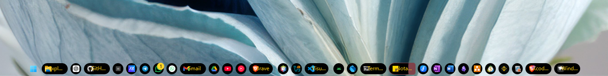

# ✦ xdark theme for Windows 11 Taskbar Styler

**Author**: [xscriptorcode](https://github.com/xscriptorcode)



## Required Windhawk Mods for Full Effect
To achieve the full implementation of the xdark theme, make sure Windows is set to the dark theme and the accent color is set to gold, then install and configure the following Windhawk mods in addition to Taskbar Styler:

- Taskbar Clock Customization – for styling the system clock.

<details>
<summary>Click to expand JSON content</summary>

```yaml
ShowSeconds: 1
TimeFormat: HH':'mm
DateFormat: dd'/'MM'/'yyyy
WeekdayFormat: ''
WeekdayFormatCustom: Sun, Mon, Tue, Wed, Thu, Fri, Sat
TopLine: ''
BottomLine: ║▌║%date% X %time% ▌│
MiddleLine: ''
TooltipLine: '%web1_full%'
TooltipLineMode: append
Width: 180
Height: 60
MaxWidth: 0
TextSpacing: 0
DataCollection:
  NetworkMetricsFormat: mbs
  NetworkMetricsFixedDecimals: -1
  PercentageFormat: spacePaddingAndSymbol
  UpdateInterval: 1
  NetworkAdapterName: ''
  GpuAdapterName: ''
MediaPlayer:
  IgnoredPlayers:
    - ''
  MaxLength: 28
  NoMediaText: No media
  RemoveBrackets: 0
WebContentWeatherLocation: ''
WebContentWeatherFormat: '%c 🌡️%t 🌬️%w'
WebContentWeatherUnits: autoDetect
WebContentsItems:
  - Url: https://rss.nytimes.com/services/xml/rss/nyt/World.xml
    BlockStart: <item>
    Start: <title>
    End: </title>
    ContentMode: xmlHtml
    SearchReplace:
      - Search: ''
        Replace: ''
    MaxLength: 28
WebContentsUpdateInterval: 10
TimeZones:
  - ''
TimeStyle:
  Hidden: 1
  TextColor: '#facc15'
  TextAlignment: Center
  FontSize: 12
  FontFamily: JetBrainsMono NF
  FontWeight: ExtraLight
  FontStyle: ''
  FontStretch: ''
  CharacterSpacing: 0
  Visible: 1
DateStyle:
  Hidden: 0
  TextColor: '#facc15'
  TextAlignment: Center
  FontSize: 12
  FontFamily: Times New Roman
  FontWeight: Light
  FontStyle: Normal
  FontStretch: SemiCondensed
  CharacterSpacing: 1
oldTaskbarOnWin11: 0
```
</details>

---

- Taskbar Height and Icon Size – to adjust the proportions and padding of taskbar items.

<details>
<summary>Click to expand JSON content</summary>

```yaml
TaskbarHeight: 35
IconSize: 15
TaskbarButtonWidth: 30
IconSizeSmall: 16
TaskbarButtonWidthSmall: 32
```
</details>

---

- Taskbar Labels for Windows 11 – to enable visible labels next to app icons.

<details>
<summary>Click to expand JSON content</summary>

```yaml
mode: labelsWithCombining
taskbarItemWidth: 60
runningIndicatorStyle: centerFixed
progressIndicatorStyle: sameAsRunningIndicatorStyle
excludedPrograms:
  - excluded1.exe
minimumTaskbarItemWidth: 50
maximumTaskbarItemWidth: 120
fontSize: 12
fontFamily: ''
textTrimming: characterEllipsis
leftAndRightPaddingSize: 8
spaceBetweenIconAndLabel: 8
runningIndicatorHeight: 0
runningIndicatorVerticalOffset: 0
alwaysShowThumbnailLabels: 0
labelForSingleItem: '%name%'
labelForMultipleItems: '[%amount%] %name%'
```
</details>

## Notes

- This theme is designed for dark, minimalistic desktop setups.
- Uses rounded corners (`CornerRadius=13`) for taskbar buttons and system tray.
- The accent color is golden yellow `#facc15` (used for text and icons).
- Some tray icons are intentionally hidden for a sleeker look.

## Highlighted Features

- Fully black background on taskbar buttons and system tray.
- Clean layout with hidden elements and padding adjustments.
- Compact and rounded system tray.

## Suggested Windows Settings

- Use default (centered) taskbar alignment.
- Set the dark theme.
- Set the gold accent color.
- Set display scale to 100% for best results.
- Hide unnecessary tray icons via Windows settings.

### Customize Icon-to-Text Spacing

If you'd like to adjust the distance between the app icon and its label (usually the app name), you can modify the following JSON property:

```json
"controlStyles[12].styles[2]": "Margin=1,0,0,0"
```

This Margin follows the format:
Margin=left,top,right,bottom

So, "Margin=1,0,0,0" sets 1 pixel of space between the icon and the text.

## Theme selection

The theme is integrated into the mod and can be selected directly from the mod's
settings:

* Open the Windows 11 Taskbar Styler mod in Windhawk.
* Go to the "Settings" tab.
* Select the theme and save the settings.

## Manual installation

The theme styles can also be imported manually. To do that, follow these steps:

* Open the Windows 11 Taskbar Styler mod in Windhawk.
* Go to the "Advanced" tab.
* Copy the content below to the text box under "Mod settings" and click "Save".

<details>
<summary>Content to import (click to expand)</summary>

```yaml
controlStyles:
  - target: Taskbar.TaskListButton
    styles:
      - CornerRadius=13
      - Padding=6,0,6,0
      - HorizontalContentAlignment=Left
  - target: SystemTray.TextIconContent > Grid#ContainerGrid > SystemTray.AdaptiveTextBlock#Base > TextBlock#InnerTextBlock
    styles:
      - FontSize=16
      - Foreground=#facc15
  - target: SystemTray.NotifyIconView#NotifyItemIcon
    styles:
      - MinWidth=25
  - target: SystemTray.OmniButton#ControlCenterButton > Grid > ContentPresenter > ItemsPresenter > StackPanel > ContentPresenter[1] > SystemTray.IconView > Grid > Grid
    styles:
      - Visibility=Collapsed
  - target: SystemTray.TextIconContent > Grid#ContainerGrid
    styles:
      - Padding=2
  - target: SystemTray.ChevronIconView
    styles:
      - MinWidth=27
  - target: SystemTray.OmniButton#NotificationCenterButton > Grid > ContentPresenter > ItemsPresenter > StackPanel > ContentPresenter > SystemTray.IconView#SystemTrayIcon > Grid > Grid > SystemTray.TextIconContent
    styles:
      - Visibility=Collapsed
  - target: Taskbar.TaskListLabeledButtonPanel > Border#BackgroundElement
    styles:
      - Background=#000000
  - target: Grid#SystemTrayFrameGrid
    styles:
      - Background=#000000
      - CornerRadius=13
      - Margin=0,5,4,5
      - Padding=2,0,-18,0
  - target: Taskbar.TaskListButton > Grid > Rectangle#RunningIndicator
    styles:
      - Height=3
      - RadiusX=1.5
      - RadiusY=1.5
      - Fill@ActiveNormal=#facc15
      - VerticalAlignment=Bottom
      - Margin=16,0,16,4
      - StrokeThickness=0
  - target: SystemTray.ImageIconContent > Grid#ContainerGrid > Image
    styles:
      - Width=13
  - target: SystemTray.TextIconContent > Grid#ContainerGrid > SystemTray.AdaptiveTextBlock#Base > TextBlock#InnerTextBlock
    styles:
      - FontSize=13
      - Foreground=#facc15
  - target: TextBlock#LabelControl
    styles:
      - FontFamily=Segoe UI Medium
      - Foreground=#facc15
      - Margin=1,0,0,0
      - VerticalAlignment=Center
      - TextWrapping=NoWrap
  - target: Taskbar.ExperienceToggleButton#LaunchListButton[AutomationProperties.AutomationId=StartButton]
    styles:
      - Visibility=Visible
  - target: Windows.UI.Xaml.Controls.TextBlock#InnerTextBlock[Text=]
    styles:
      - Text=
      - Foreground=#facc15
  - target: Taskbar.TaskbarFrame > Grid#RootGrid > Taskbar.TaskbarBackground > Grid > Rectangle#BackgroundFill
    styles:
      - Fill=Transparent
  - target: Rectangle#BackgroundStroke
    styles:
      - Fill=Transparent
  - target: SystemTray.TextIconContent > Grid#ContainerGrid > SystemTray.AdaptiveTextBlock#Base > TextBlock#InnerTextBlock
    styles:
      - Foreground=#facc15
```
</details>
