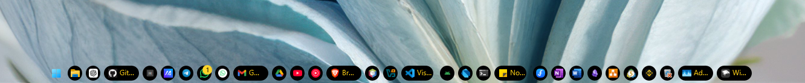

# ✦ xdark theme for Windows 11 Taskbar Styler :3

**Author**: [xscriptorcode](https://github.com/xscriptorcode)



# ✦ Notes

- This theme is designed for dark, minimalistic desktop setups.
- Uses rounded corners (`CornerRadius=13`) for taskbar buttons and system tray.
- Accent color is golden yellow `#facc15`, used for text and icons.
- Running indicators are invisible, making the interface cleaner.
- Some tray icons are intentionally hidden for a sleeker look.

# ✦ Highlighted Features

- Fully black background on taskbar buttons and system tray.
- Clean layout with hidden elements and padding adjustments.
- Gold-accented icons for enhanced visibility on dark backgrounds.
- Custom Start icon glyph (``).
- Compact and rounded system tray.

# ✦ Suggested Windows Settings

- Use default (centered) taskbar alignment.
- Set display scale to 100% for best results.
- Hide unnecessary tray icons via Windows settings.

# ✦ Theme Selection

To enable this theme via Windhawk:

* Open the **Windows 11 Taskbar Styler** mod in Windhawk.
* Go to the **Settings** tab.
* Select `xdark` and click **Save**.

# ✦ Manual Installation

You can manually import the styles like this:

* Open the **Windows 11 Taskbar Styler** mod in Windhawk.
* Go to the **Advanced** tab.
* Paste the following JSON content in the "Mod settings" section and click **Save**.

<details>
<summary>Click to expand JSON content</summary>

```json

{
  "theme": "",
  "controlStyles[0].target": "Taskbar.TaskListButton",
  "controlStyles[0].styles[0]": "CornerRadius=13",
  "resourceVariables[0].variableKey": "",
  "resourceVariables[0].value": "",
  "controlStyles[1].target": "SystemTray.TextIconContent > Grid#ContainerGrid > SystemTray.AdaptiveTextBlock#Base > TextBlock#InnerTextBlock",
  "controlStyles[1].styles[0]": "FontSize=16",
  "controlStyles[1].styles[1]": "Foreground=#facc15",
  "controlStyles[2].target": "SystemTray.NotifyIconView#NotifyItemIcon",
  "controlStyles[2].styles[0]": "MinWidth=25",
  "controlStyles[3].target": "SystemTray.OmniButton#ControlCenterButton > Grid > ContentPresenter > ItemsPresenter > StackPanel > ContentPresenter[1] > SystemTray.IconView > Grid > Grid",
  "controlStyles[3].styles[0]": "Visibility=Collapsed",
  "controlStyles[4].target": "SystemTray.TextIconContent > Grid#ContainerGrid",
  "controlStyles[4].styles[0]": "Padding=2",
  "controlStyles[5].target": "SystemTray.ChevronIconView",
  "controlStyles[5].styles[0]": "MinWidth=27",
  "controlStyles[6].target": "SystemTray.OmniButton#NotificationCenterButton > Grid > ContentPresenter > ItemsPresenter > StackPanel > ContentPresenter > SystemTray.IconView#SystemTrayIcon > Grid > Grid > SystemTray.TextIconContent",
  "controlStyles[6].styles[0]": "Visibility=Collapsed",
  "controlStyles[7].target": "Taskbar.TaskListLabeledButtonPanel > Border#BackgroundElement",
  "controlStyles[7].styles[0]": "Background=#000000",
  "controlStyles[7].styles[1]": "CornerRadius=13",
  "controlStyles[8].target": "Grid#SystemTrayFrameGrid",
  "controlStyles[8].styles[0]": "Background=#000000",
  "controlStyles[8].styles[1]": "CornerRadius=13",
  "controlStyles[8].styles[2]": "Margin=0,5,4,5",
  "controlStyles[8].styles[3]": "Padding=2,0,-18,0",
  "controlStyles[9].target": "Taskbar.TaskListLabeledButtonPanel@CommonStates > Rectangle#RunningIndicator",
  "controlStyles[9].styles[0]": "Height=27",
  "controlStyles[9].styles[1]": "RadiusX=13",
  "controlStyles[9].styles[2]": "RadiusY=13",
  "controlStyles[9].styles[3]": "StrokeThickness=0",
  "controlStyles[9].styles[4]": "Stroke@InactivePointerOver=Transparent",
  "controlStyles[9].styles[5]": "Stroke@InactivePressed=Transparent",
  "controlStyles[9].styles[6]": "Stroke@ActiveNormal=Transparent",
  "controlStyles[9].styles[7]": "Stroke@ActivePointerOver=Transparent",
  "controlStyles[9].styles[8]": "Stroke@ActivePressed=Transparent",
  "controlStyles[9].styles[9]": "Fill=Transparent",
  "controlStyles[10].target": "SystemTray.ImageIconContent > Grid#ContainerGrid > Image",
  "controlStyles[10].styles[0]": "Width=13",
  "controlStyles[11].target": "SystemTray.TextIconContent > Grid#ContainerGrid > SystemTray.AdaptiveTextBlock#Base > TextBlock#InnerTextBlock",
  "controlStyles[11].styles[0]": "FontSize=13",
  "controlStyles[11].styles[1]": "Foreground=#facc15",
  "controlStyles[12].target": "TextBlock#LabelControl",
  "controlStyles[12].styles[0]": "FontFamily=Segoe UI Medium",
  "controlStyles[12].styles[1]": "Foreground=#facc15",
  "controlStyles[13].target": "Taskbar.ExperienceToggleButton#LaunchListButton[AutomationProperties.AutomationId=StartButton]",
  "controlStyles[13].styles[0]": "Visibility=Visible",
  "controlStyles[14].target": "Windows.UI.Xaml.Controls.TextBlock#InnerTextBlock[Text=]",
  "controlStyles[14].styles[0]": "Text=",
  "controlStyles[14].styles[1]": "Foreground=#facc15",
  "controlStyles[15].target": "Rectangle#BackgroundFill",
  "controlStyles[15].styles[0]": "Fill=Transparent",
  "controlStyles[16].target": "Rectangle#BackgroundStroke",
  "controlStyles[16].styles[0]": "Fill=Transparent",
  "controlStyles[17].target": "TextBlock#LabelControl",
  "controlStyles[17].styles[0]": "Foreground=#facc15",
  "controlStyles[18].target": "SystemTray.TextIconContent > Grid#ContainerGrid > SystemTray.AdaptiveTextBlock#Base > TextBlock#InnerTextBlock",
  "controlStyles[18].styles[0]": "Foreground=#facc15"
}

```

</details>
