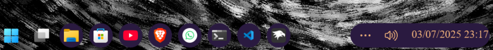

# xgrapepurple theme for Windows 11 Taskbar Styler

**Author**: [xscriptorcode](https://github.com/xscriptorcode)



**Note**: This theme is designed for any environments and features a rich purple base with soft golden text accents.

# Required Windhawk Mods for Full Effect
To achieve the full implementation of the xgrapepurple theme, make sure to have your windows on dark theme and install and configure the following Windhawk mods in addition to Taskbar Styler:

- Taskbar Clock Customization – for styling the system clock.

<details>
<summary>Click to expand JSON content</summary>

```json
{
  "ShowSeconds": 1,
  "TimeFormat": "HH':'mm",
  "DateFormat": "dd'/'MM'/'yyyy",
  "WeekdayFormat": "",
  "TopLine": "",
  "MiddleLine": "",
  "BottomLine": "%date% %time%",
  "TooltipLine": "%web1_full%",
  "Width": 180,
  "Height": 60,
  "TextSpacing": 0,
  "TimeStyle.Visible": 1,
  "TimeStyle.TextColor": "#e7ab79",
  "TimeStyle.TextAlignment": "Center",
  "TimeStyle.FontSize": 11,
  "TimeStyle.FontFamily": "JetBrainsMono NF",
  "TimeStyle.FontWeight": "ExtraLight",
  "TimeStyle.FontStyle": "",
  "TimeStyle.FontStretch": "",
  "TimeStyle.CharacterSpacing": 0,
  "DateStyle.TextColor": "#e7ab79",
  "DateStyle.TextAlignment": "Center",
  "DateStyle.FontSize": 11,
  "DateStyle.FontFamily": "Times New Roman",
  "DateStyle.FontWeight": "Light",
  "DateStyle.FontStyle": "Normal",
  "DateStyle.FontStretch": "SemiCondensed",
  "DateStyle.CharacterSpacing": 1,
  "oldTaskbarOnWin11": 0,
  "MaxWidth": 0,
  "TimeStyle.Hidden": 1,
  "DateStyle.Hidden": 0
}

```

</details>

---

- Taskbar Height and Icon Size – to adjust the proportions and padding of taskbar items.

<details>
<summary>Click to expand JSON content</summary>

```json

{
  "IconSize": 15,
  "TaskbarHeight": 35,
  "TaskbarButtonWidth": 30
}

```

</details>

---

- Taskbar Labels for Windows 11 – to enable visible labels next to app icons.

<details>
<summary>Click to expand JSON content</summary>

```json

{
  "taskbarItemWidth": 60,
  "minimumTaskbarItemWidth": 50,
  "maximumTaskbarItemWidth": 120,
  "runningIndicatorStyle": "centerFixed",
  "progressIndicatorStyle": "sameAsRunningIndicatorStyle",
  "fontSize": 12,
  "leftAndRightPaddingSize": 8,
  "spaceBetweenIconAndLabel": 8,
  "labelForSingleItem": "%name%",
  "labelForMultipleItems": "[%amount%] %name%",
  "mode": "labelsWithCombining",
  "excludedPrograms[0]": "excluded1.exe",
  "alwaysShowThumbnailLabels": 0,
  "fontFamily": "",
  "runningIndicatorHeight": 0,
  "runningIndicatorVerticalOffset": 0
}

```

</details>

---

# Overview

`xgrapepurple` is a sleek and modern taskbar theme for Windows 11 inspired by deep purple grape tones. Built using the Windhawk mod **Taskbar Styler**, it features a dark violet background (`#2a1a40`) with elegant gold-rose accent text (`#e7ab79`). Buttons have rounded corners and spacing is carefully tuned for visual clarity and comfort.

The system tray, taskbar buttons, and indicators are all styled for consistency and minimalism.

---

# Manual Installation

You can manually import the styles like this:

- Open the **Windows 11 Taskbar Styler** mod in Windhawk.
- Go to the **Advanced** tab.
- Paste the JSON content of this theme in the "Mod settings" section and click **Save**.

<details>
<summary>Click to expand JSON content</summary>

```json

{
  "theme": "xgrapepurple",
  "controlStyles[0].target": "Taskbar.TaskListButton",
  "controlStyles[0].styles[0]": "CornerRadius=13",
  "resourceVariables[0].variableKey": "",
  "resourceVariables[0].value": "",
  "controlStyles[1].target": "SystemTray.TextIconContent > Grid#ContainerGrid > SystemTray.AdaptiveTextBlock#Base > TextBlock#InnerTextBlock",
  "controlStyles[1].styles[0]": "FontSize=16",
  "controlStyles[1].styles[1]": "Foreground=#e7ab79",
  "controlStyles[2].target": "SystemTray.NotifyIconView#NotifyItemIcon",
  "controlStyles[2].styles[0]": "MinWidth=25",
  "controlStyles[3].target": "SystemTray.OmniButton#ControlCenterButton > Grid > ContentPresenter > ItemsPresenter > StackPanel > ContentPresenter[1] > SystemTray.IconView > Grid > Grid",
  "controlStyles[3].styles[0]": "Visibility=Collapsed",
  "controlStyles[4].target": "SystemTray.TextIconContent > Grid#ContainerGrid",
  "controlStyles[4].styles[0]": "Padding=2",
  "controlStyles[5].target": "SystemTray.ChevronIconView",
  "controlStyles[5].styles[0]": "MinWidth=27",
  "controlStyles[6].target": "SystemTray.OmniButton#NotificationCenterButton > Grid > ContentPresenter > ItemsPresenter > StackPanel > ContentPresenter > SystemTray.IconView#SystemTrayIcon > Grid > Grid > SystemTray.TextIconContent",
  "controlStyles[6].styles[0]": "Visibility=Collapsed",
  "controlStyles[7].target": "Taskbar.TaskListLabeledButtonPanel > Border#BackgroundElement",
  "controlStyles[7].styles[0]": "Background=#2a1a40",
  "controlStyles[7].styles[1]": "CornerRadius=13",
  "controlStyles[8].target": "Grid#SystemTrayFrameGrid",
  "controlStyles[8].styles[0]": "Background=#2a1a40",
  "controlStyles[8].styles[1]": "CornerRadius=13",
  "controlStyles[8].styles[2]": "Margin=0,5,4,5",
  "controlStyles[8].styles[3]": "Padding=2,0,-18,0",
  "controlStyles[9].target": "Taskbar.TaskListButton > Grid > Rectangle#RunningIndicator",
  "controlStyles[9].styles[0]": "Height=3",
  "controlStyles[9].styles[1]": "RadiusX=1.5",
  "controlStyles[9].styles[2]": "RadiusY=1.5",
  "controlStyles[9].styles[3]": "Fill@ActiveNormal=SystemAccentColor",
  "controlStyles[9].styles[4]": "Fill@InactiveNormal=#33475b",
  "controlStyles[9].styles[5]": "VerticalAlignment=Bottom",
  "controlStyles[9].styles[6]": "Margin=16,0,16,4",
  "controlStyles[9].styles[7]": "StrokeThickness=0",
  "controlStyles[10].target": "SystemTray.ImageIconContent > Grid#ContainerGrid > Image",
  "controlStyles[10].styles[0]": "Width=13",
  "controlStyles[11].target": "SystemTray.TextIconContent > Grid#ContainerGrid > SystemTray.AdaptiveTextBlock#Base > TextBlock#InnerTextBlock",
  "controlStyles[11].styles[0]": "FontSize=13",
  "controlStyles[11].styles[1]": "Foreground=#e7ab79",
  "controlStyles[12].target": "TextBlock#LabelControl",
  "controlStyles[12].styles[0]": "FontFamily=Segoe UI Medium",
  "controlStyles[12].styles[1]": "Foreground=#e7ab79",
  "controlStyles[12].styles[2]": "Margin=1,0,0,0",
  "controlStyles[13].target": "Taskbar.ExperienceToggleButton#LaunchListButton[AutomationProperties.AutomationId=StartButton]",
  "controlStyles[13].styles[0]": "Visibility=Visible",
  "controlStyles[14].target": "Windows.UI.Xaml.Controls.TextBlock#InnerTextBlock[Text=]",
  "controlStyles[14].styles[0]": "Text=",
  "controlStyles[14].styles[1]": "Foreground=#e7ab79",
  "controlStyles[15].target": "Rectangle#BackgroundFill",
  "controlStyles[15].styles[0]": "Fill=Transparent",
  "controlStyles[16].target": "Rectangle#BackgroundStroke",
  "controlStyles[16].styles[0]": "Fill=Transparent"
}


```

</details>

---

## Notes

- Deep purple (`#2a1a40`) background for taskbar buttons and system tray.
- Rose-golden (`#e7ab79`) text and icon color for a warm, elegant glow.
- Rounded corners (`CornerRadius=13`) for all buttons and containers.
- Running indicator uses Windows system accent color when active.
- Clear separation between icon and label using `Margin=4,0,0,0`.

---

## Suggested Windows Settings

- Use the default (centered) taskbar alignment.
- Enable **dark mode** in Windows to ensure proper contrast.
- Set display scale to 100% for best clarity.
- Hide unnecessary tray icons for a cleaner layout.
- Combine with a dark, abstract or cosmic wallpaper for a fully immersive aesthetic.
